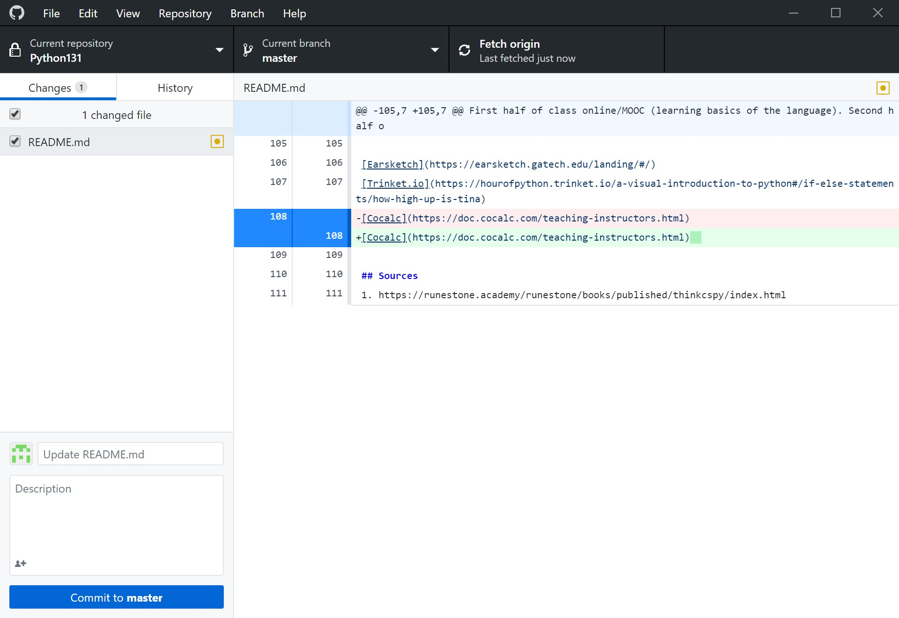
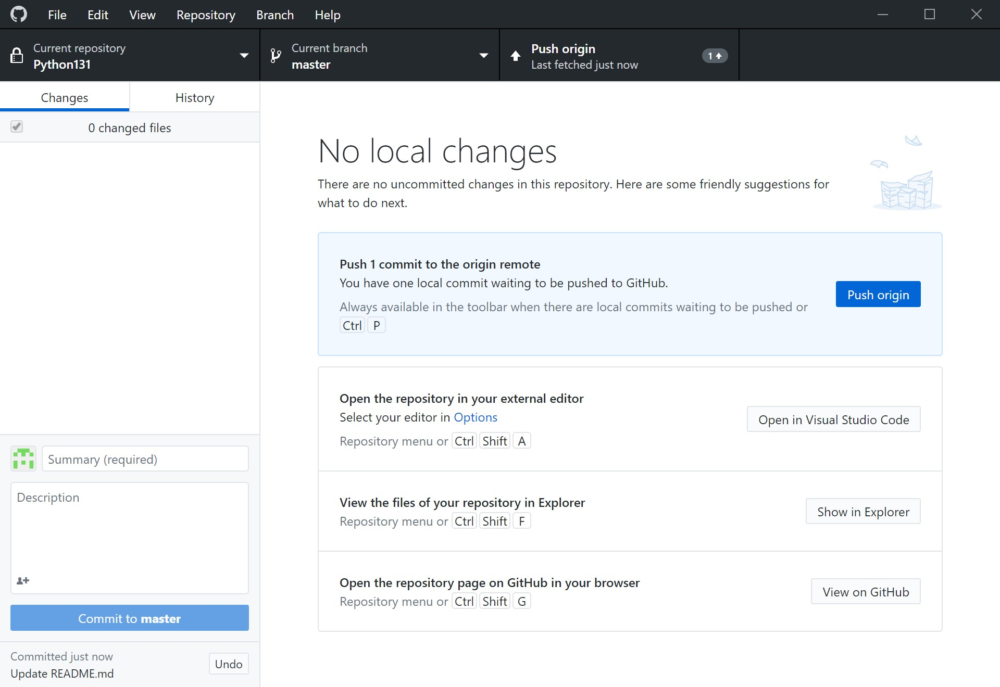
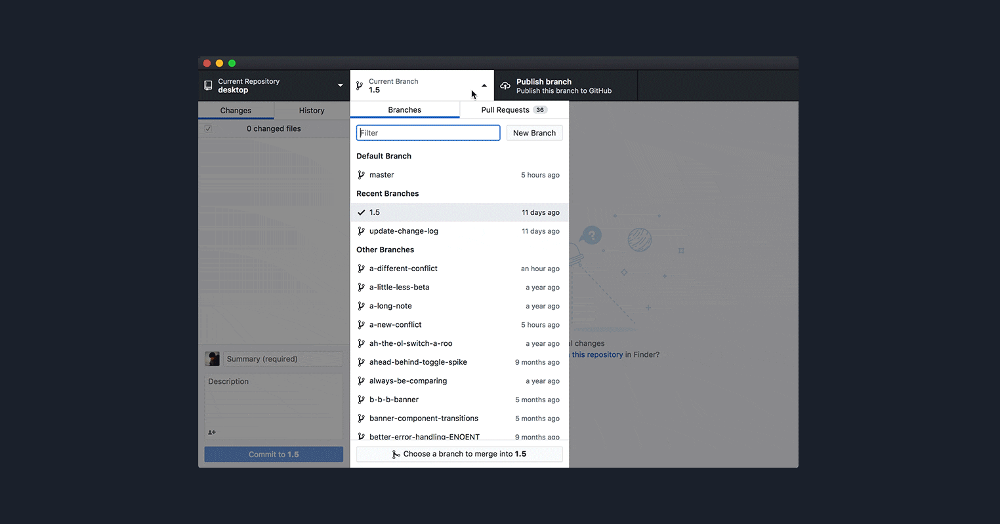

# Version Control

## Why version control?

Have you ever ... (Source: Stack overflow)
- Made a change to code, realised it was a mistake and wanted to revert back?
- Lost code or had a backup that was too old?
- Had to maintain multiple versions of a product?
- Wanted to see the difference between two (or more) versions of your code?
- Wanted to prove that a particular change broke or fixed a piece of code?
- Wanted to review the history of some code?
- Wanted to submit a change to someone else's code?
- Wanted to share your code, or let other people work on your code?
- Wanted to see how much work is being done, and where, when and by whom?
- Wanted to experiment with a new feature without interfering with working code?

## Setup

- Install Git: http://git-scm.com/book/en/Getting-Started-Installing-Git
- Sign up for GitHub
- Install the GUI
    + http://mac.github.com/
    + http://windows.github.com/

## Workflow

Every time you work on a group project that is stored in git, you should pull right away, do your work, then commit and push immediately.
I recommend doing this workflow every time you make a significant change or start working on something else. It backs up your work so that 
you can go back to an earlier version in case you mess something up later.

### Pull

This updates your repository to the newest version so that when other people on your team make changes, you will be able to have the most recently
updated version of the code/repository.

In the picture above, to pull, click on "Fetch origin".

### Commit

This is step 1 of adding your changes to GitHub (push is step 2). Committing your changes requires that you specify which changed files you want 
to commit as well as a brief commit message summarizing what you changed since the last commit.

In the picture above, to commit, click on "Commit to master" once you've selected the files to commit in the left pane.

### Push

This is step 2 of adding your changes to GitHub. You can think of committimg as wrapping up a gift that you made and pushing is mailing it to the recipient.
They don't "open" the gift until they Pull and see what you pushed. Pushing uploads all un-pushed commits to GitHub so that you can see them
in GitHub desktop as well as your repository online. 

In the picture above, after you've committed, to push, click on "Push origin".

## Branches

Large software projects use branches to have a production environment that is always working, and other branches for new feature development.
Once a feature is ready, the development branch can be merged with the production branch (typically master). You'll have to manually choose which
version of each file to keep.

In the picture above, to switch branches, click on the "Current branch" button and either create a new branch or select an existing one.

## Forking

If you see someone's repository and want to copy it and make your own changes without affecting their repository (and potentially without them even knowing),
you can "fork" the repository. This gives you your own copy of it to mess with as you please.

## Reverting

If you make a mistake and commit and push it (or your team member does), you can revert to a prior commit. This is why it's super useful
to commit and push regularly!!! You can revert from any commit which will set your current repository state back to exactly what it looked 
like at that exact moment in time.

## Conflict management

To create a conflict, you'll need two people with access to the same repository (or two computers that both have the repo cloned).
- Both people/computers sync back up
- Person/computer 1 should add a new file
- Person/computer 1 should commit and push their new file
- Person/computer 2 should pull and see the new file
- Person/computer 1 should type something in this file like "hello world"
- Person/computer 1 should commit and push
- Person/computer 2 should type something in this file like "helol world"
- When person/computer 2 commits and pushes, it will cause a conflict that they will have to resolve

Here's a gif of how merge conflicts work in GitHub desktop

## Version Control in RStudio

If you have a GitHub repository that you want to open in RStudio, here are the steps:

1. Open RStudio
2. File -> New Project -> Version Control -> Git
3. Paste your repository URL and change where you want it to clone the repository on your local machine
4. All of the files in the repository are now found in the "files" tab in RStudio.
5. To pull, open the "git" tab and click the blue down arrow.
6. To commit, select the check boxes next to the changed files you wish to commit and click the "commit" button.
7. To push, click the green up arrow.

Note: if you want to switch branches, you can click on "master" in the git tab. To switch projects, click on the cube icon in the top right
corner. This gives you options for creating a new project, viewing recent projects, and opening existing projects.

For more info, check out [this link](https://support.rstudio.com/hc/en-us/articles/200532077?version=1.1.463&mode=desktop) or this video:
<iframe width="560" height="315" src="https://www.youtube.com/embed/kL6L2MNqPHg" frameborder="0" allow="accelerometer; autoplay; encrypted-media; gyroscope; picture-in-picture" allowfullscreen></iframe>