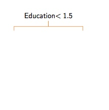
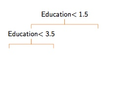
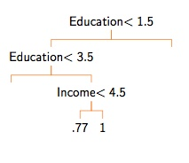
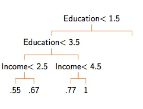
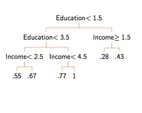

# Machine Learning

## Supervised Learning

### The Gist

1. We want to build some function $f(X)$ that explains/predicts/correlates with observed outcome $y$.
    * Note that the capital $X$ denotes an entire dataset
    * Typically we say that $X$ is a n-by-d matrix, where n is the number of datapoints and d is the number of dimensions each datapoint has

2. A function, $f(X)$, can be something simple like a line or something more complex.

3. We are going to use this function to:
    * Predict $y$ for a new $x_hat$
    * Identify elements of $X$ that seem important
    * Explore interesting relationships
    * Maybe for theory testing, but will need to be careful

### What could go wrong?

**Problem 1**: Infinity is a big number
- The are an infinite number of potential functions, $f(\cdot)$.
- We can't try all possible functions.  That problem isn't clearly defined.
    
**Problem 2**: Not enough data
- Even if we knew a subset of $f(\cdot)$ to consider, we may not have enough data
- If $f(\cdot)$ is complex, can be particularly hard to approximate unless large $n$

**Problem 3**: What are the right features?
- Even if we have some idea of $f(\cdot)$ and a lot of data, we don't always know the right features to include.
- And in some cases there are *a lot* of features.

**Problem 4**: Is it signal or is it error?
- A lot of outcomes we want to study are "noisy"
- We are usually not interested in the noise
- One way to think of this is that $f(\cdot)$ can be divided into two compoenents
    * Systematic component
    * Error component
   
Example: The linear regression
    
$$f(X) = \underbrace{\beta_0 + \beta_1x_1 + \beta_2 x_2}_{systematic} + \underbrace{\epsilon}_{error}$$
$$\epsilon  \sim N(0, \sigma^2)$$


**Problem 5**: Putting it all together  

- We don't know if we have the right "set" of functions to consider. 
- Even if we did, we don't have infinite data.
- And we don't even know if we are using the right features.
- So we can't ever be sure we are separating out the systematic and error portions.


**Problem 6**: Meta problems
- In many settings, the DGP is not static.
- There may be unknown unknowns.
- It is difficult or impossible to know if the data used to train your model is useful for the task at hand.

### Example: Predicting presidential elections with vote share

Today we are going to use the results of US presidential elections since 1948
```{r, eval=TRUE, message=FALSE, warning=FALSE}
library(tidyverse)
electData<-read.csv("http://politicaldatascience.com/PDS/Datasets/presElect.csv")
```

- **Year**: Year of the election
- **q2gdp**: GDP in the second quarter
- **vote**: Share of the two-party vote that went to the **incumbent party.**
- **term**: 1=Incumbent party has served more than one term; 0 = First term for incumbent party
- **JuneApp**: Approval as recorded in June prior to the election.
- **Inc**: Indicator if the **incumbent party** candidate is the current incumbent (meaning they are a first-term incument).


#### Linear regression

```{r, eval=TRUE, message=FALSE, warning=FALSE, echo=FALSE, fig.width=12}
par(mar=c(2,2,.5,.5), mgp=c(1,0,0), tcl=0, cex.lab=1)
plot(electData$q2gdp, electData$vote, ylab="Incumbent party share of vote", xlab="Q2 GDP Growth", ylim=c(44, 64), pch="", xlim=c(-8, 10.5), cex=.8)
abline(h=seq(45, 65, by=5), col="gray80")
abline(lm(electData$vote~electData$q2gdp), lwd=2)
points(electData$q2gdp[1:17], electData$vote[1:17], ylab="Incumbent party share of vote", xlab="Q2 GDP Growth", ylim=c(44, 64), pch=19, xlim=c(-8, 10.5), cex=.8)
text(electData$q2gdp[1:17]+.65, electData$vote[1:17], electData$year[1:17], cex=1.2)
points(electData$q2gdp[18], electData$vote[18], ylab="Incumbent party share of vote", xlab="Q2 GDP Growth", ylim=c(44, 64), pch=19, xlim=c(-8, 10.5), cex=.8, col="red")
text(electData$q2gdp[18]+.65, electData$vote[18], electData$year[18], cex=1.2, col="red")
```

We'll use the `lm` function to generate a linear model

```{r, eval=TRUE, message=FALSE, warning=FALSE, echo=TRUE}
Model1<-lm(vote~q2gdp, data=electData)
summary(Model1)
```

Inuition for the linear model

    
$$f(X) = \underbrace{\beta_0 + \beta_1x_1 + \beta_2 x_2}_{systematic} + \underbrace{\epsilon}_{error}$$
$$\epsilon  \sim N(0, \sigma^2)$$

- The "Multiple R-squared" is a fit statistic.
    * Ranges from 0 to 1
    * Closer to 1 is better

- The "Estimate" is the coefficient

- The "Std. Error" is what we talked about in our previous lecture and is used to construct confidence intervals.

- Smaller p-values mean there is more evidence that that specific variable matters (sort of)

#### Prediction

Let's train our model using the data before 2016, then see what it predicts the vote will be for the 2016 election.

```{r, eval=TRUE, message=FALSE, warning=FALSE, echo=TRUE}
electData$vote[electData$year==2016]
Model2<-lm(vote~q2gdp+JuneApp, data=electData[electData$year!=2016,])
predict(Model2, newdata=electData[electData$year==2016,])
```

Pretty good!

#### Feature selection


```{r, eval=TRUE, message=FALSE, warning=FALSE, echo=TRUE}
Model3<-lm(vote~q2gdp+JuneApp, data=electData)
summary(Model3)
```

- R-squared for the simpler model was 0.366
- Adding June approval bumps it to 0.752 -- way bigger

What does that mean? The R-squared denotes the portion of the variation in the y value that is explained or predicted by the x values.

Adding more predictors *always* increases $R^2$.


#### Exploration


```{r, eval=TRUE, message=FALSE, warning=FALSE, echo=TRUE}
Model4<-lm(vote~JuneApp+Inc, data=electData)
summary(Model4)
```


- So that's interesting.
- When a party is running for a second term, they do better.
    - Yes: Eisenhower, Kennedy, Nixon, Reagan, Clinton, Bush II, Obama
    - No: Carter
- Might be worth looking into more.


#### Theory testing?


- Is this data by itself evidence that incumbent candidate is always at an advantage?
- Not really that convincing.  Many other explanations.

### The complexity of keeping it simple


- Simple models can be good, especially with small samples.
- But more complex models *might* be better:
    * Maybe a more flexible $f(\cdot)$ than a line?
    * Maybe more options for $X$?

- We want to aim for models that are:
    * Complex enough to capture important aspects of reality
    * Not so complex they confuse signal with noise


#### A new example

```{r, eval=TRUE, message=FALSE, warning=FALSE}
library(readr)
senateData<-read_csv("http://politicaldatascience.com/PDS/Datasets/SenateForecast/CandidateLevel.csv")
```

This is data on US Senate elections from 1992-2016.
- **VotePercentage**: Percentage of the vote for that candidate
- **Republican**: 1=Republican, 0=Any other
- **Democrat**: 1=Democrat, 0=Any other
- **Experienced**: 1=Candidate has held elected office, 0=otherwise
- **weightexperience**: 1 = no experience, 4=held statewide office
- **pvi**: Presidential vote index (Higher values mean more friendly to Democrats)
- **Generic Ballot**: Generic ballot polling for that candidate's party in that year
- **Incumbent**: -1 = Running against incument, 0=open seat, 1 = Is the incumbent 
- **PercentageRaised**: Percent of money for that race raised by that candidate


Model 1: Simple


```{r, eval=TRUE, message=FALSE, warning=FALSE}
SimpleModelFull<-lm(VotePercentage~pvi*Republican+Incumbent, data=senateData)
summary(SimpleModelFull)$r.squared
```

Model 2: Complex


```{r, eval=TRUE, message=FALSE, warning=FALSE, size=2}
ComplexModelFull<-lm(VotePercentage~pvi*Republican+weightexperience 
                 + GenericBallotSept*Republican + Incumbent, data=senateData)
summary(ComplexModelFull)$r.squared
```

Seems a little better

So what's that mean?

- Looks like the complex model is doing much better

- But is that real, or illusory?

- We can partially resolve that by doing a **cross validation**

- Several ways to do this, but here is a very easy one.
    * Divide your data into two parts, training and validation
    * Fit your model on your training data
    * Test on your validation data (the data you didn't use to fit the model)


#### Cross Validation

```{r, eval=TRUE, message=FALSE, warning=FALSE, size=2}
library(rsample)
split_senateData<-initial_split(senateData, prop=.8)
senate_train<-training(split_senateData)
senate_test<-testing(split_senateData)
```


Let's look at those:
```{r, eval=TRUE, message=FALSE, warning=FALSE, size=2}
dim(senate_train)
dim(senate_test)
```


Let's test out the simple model


```{r, eval=TRUE, message=FALSE, warning=FALSE, size=2}
SimpleModelTrain<-lm(VotePercentage~pvi*Republican+Incumbent, data=senate_train)
SimpleModelPredictions<-predict(SimpleModelTrain, newdata=senate_test)
```

Now we will calculate the root mean squared error (RMSE) comparing the predictions, $y^\ast$, with what we actually observed, $y$. 

$$RMSE=\sqrt{\frac{\sum_i^n(y_i^\ast-y_i)^2}{n}}$$


```{r, eval=TRUE, message=FALSE, warning=FALSE, size=2}
sqrt(mean((SimpleModelPredictions-senate_test$VotePercentage)^2))
```


Let's do the same for the more complex model

- Fit the model
- Make predictions for the training set

```{r, eval=TRUE, message=FALSE, warning=FALSE, size=2}
ComplexModelTrain<-lm(VotePercentage~pvi*Republican+weightexperience 
                 + GenericBallotSept*Republican + Incumbent, data=senate_train)
ComplexModelPredictions<-predict(ComplexModelTrain, newdata=senate_test)
```


```{r, eval=TRUE, message=FALSE, warning=FALSE, size=2}
sqrt(mean((ComplexModelPredictions-senate_test$VotePercentage)^2))
```


More on cross-validation

- One problem here is that the result may be somewhat sensitive to the particular way you partition your data.  Maybe that 20% you pulled out were unusual?
- k-fold cross-validation tries to get around this by:
    - Randomly dividing the data into k groups
    - Each group serves as the test sample once
    - So We have "out-of-sample" predictions for all cases
- You can also do Monte Carlo cross-validation, where you do this 90-10 random partitioning multiple times.    

Summary

- There is a tension between complexity and predictive accuracy
- More complex models may better explain the data you have, but may do worse in prediction.
- Cross validation is a fundamental tool for addressing this dilemma.

## Classification

### Classification basics: Binary outcomes

- The difference between regression and classification is that we look at a special type of function, $f(X)$.

- We want a function that will:
    - Take in a dataset $X$ that can take on all kinds of values (binary, continuous, etc.)
    - But it will "squash" all of these features so that $f(X) \in [0, 1]$.  
    - We then say that the probability that $y=1$ is equal to $f(x)$, or 
    $$Pr(y=1) = f(x)$$
- Intuitively, we are imagining a weighted coin flip where the pobability of a "success" is determined by $f(x)$.

Motivating example: Turnout in the 2008 election

- Imagine we are trying to build a model to predict turnout (0 or 1)
- We have the following features:
    * State
    * Ethnicity (White/Black/Hispanic/Other)
    * Age (Divided into quartiles)
    * Income (Divided into quitiles)

```{r, eval=TRUE, message=FALSE, warning=FALSE}
turnout<-read.csv("http://politicaldatascience.com/PDS/Datasets/SimpleTurnout2008.csv")
dim(turnout)
```

### The linear classifier (AKA Logit)

- Logit is a member of a family of models called a "generalized linear model"
- These models have two basic parts:
    - A *linear* component
    - A *squashing* component


The linear part:

We might for instance, set up an equation of:

$$\Lambda=\beta_0 + \beta_1 \text{Income}+ \beta_2 \text{Age}$$

- This is the same basic idea as normal regression models.
- But this linear combination can take on any value between $-\infty$ and $\infty$ (depending on what the $\beta$ values are)


- $\beta_0 = 16$
- $\beta_1=2$
- $\beta_2 = 1.5$
- Income = 2
- Age = 2

$$23 = 16 + 2\times 2 + 1.5\times2$$


The squashing part:

- But we can't use numbers like 23 to talk about turnout directly.  

- And there is nothing keeping this from evaluating to -200 or 3,272

- So the strategy will be to push $\Lambda$ through a squasher

- These are often shaped like an "s", and are sometimes called a *sigmoid*.

- I am going to notate this as $\sigma(\cdot)$

$$f(X) = \sigma(\Lambda)$$

The logistic squasher:

- A very common choice for $\sigma(\cdot)$ is the logistic function:

$$\sigma(\Lambda) = \frac{1}{1+\exp(-\Lambda)} = \frac{\exp(\Lambda)}{1+\exp(\Lambda)}$$

```{r, eval=TRUE, message=FALSE, warning=FALSE, fig.width=8, fig.height=4}
myLogistic<-function(Lambda){
  return(1/(1+exp(-1*Lambda)))
}
testValues<-seq(-8, 8, by=.1)
plot(testValues, myLogistic(testValues), type="l", ylab="Pred. Prob.")
```

So let's take a minute:

- Use the function from before and assume that:

$$\Lambda = -2 + (1 \times \text{Income}) + (0.7\times \text{Age})  $$

- What is $\Lambda$ when Income=2 and Age=4?
- Put that through our squasher and find out what the predicted probability will be.
- Do both calculations again but now assume Income=4 and Age=4


In general,

- Do the linear part first to get $\Lambda$.
- Then use the function `myLogistic`to calculate the predicted probability.

#### The linear classifier in theory

- Remember what we are trying to do: find some function $f(X)$.
- We have a linear portion like $\beta_1 \text{Income}+ \beta_2 \text{Age}$
- We put it through a squasher like the logistic function on Slide 9.
- When we combine this we get:

$$Pr(y=1) = \frac{\exp(\beta_0 + \beta_1 \text{Income}+ \beta_2 \text{Age})}{1+\exp(\beta_0 + \beta_1 \text{Income}+ \beta_2 \text{Age})} $$

- But how do we figure out the $\beta$ coefficients?

#### The linear classifier in practice

- For this class we'll use something maximum likelihood estimation.
- Basically, the computer will find the values of $\beta$ that minimize a specific form of loss
- All you really need to know is how to do it.
    * We use the `glm` function.
    * We specify that the data is binary by using the `family="binomial"` argument.

```{r, eval=TRUE, message=FALSE, warning=FALSE, fig.width=8, fig.height=4}
Model1<-glm(turnout ~ inc + age, family="binomial", data=turnout)
summary(Model1)
```

A couple of takeaways:

- The coefficients reported here are from the linear part of the model.
    * You want to focus on the sign of the coefficients
    * And again you can get standard errors and p-values 
- The AIC number is a fit statistic, and we want it to be small (but hard to interpret)
- We can use the same `predict` approach we used before.
    * If we don't specify new data, it generates "in sample" predictions.
    * You want to use the option `type` to make sure you get the predicted probability part back and not the linear part.

```{r, eval=TRUE, message=FALSE, warning=FALSE, fig.width=8, fig.height=4}
Model1preds<-predict(Model1, type="response")
```

Let's look at the predicted probabilities for each value of Age in the dataset.

```{r, eval=TRUE, message=FALSE, warning=FALSE, fig.width=8, fig.height=7}
boxplot(Model1preds~turnout$inc, xlab="Income", ylab="Predicted Probabilities")
```

Now it's your turn:

- Fit your own linear classifier to this data using the data I've provided.
- You might try some new variables or even recoding a covariate if you want.
- Look at the output and make sure you understand what the coefficients are telling you (more or less).

#### Fit statistics

- When we talked about regression, I emphasized the importance of out-of-sample testing to keep from "overfitting the data."
    - Complex models might seem to fit the data well, but do poorly out of sample.
    - Ths reflects a model that is confusing the "systematic" part of the data with the "error" part of the data.
- I introduced RMSE as a metric.  But what should we use for binary cases?

- There are a lot of choices here, and this is again a large topic I will only touch on.
- The easiest place to start is a "confusion matrix"

$$\begin{array}{lcc}
& \text{Truth=0} & \text{Truth=1}\\
\text{Prediction = 0} & \text{True negatives} & \text{False negatives}\\
\text{Prediction = 1} & \text{False positives} & \text{True Positives}\\
\end{array}$$

- The main diagnonal of this matrix are your correct predictions.
- Should you weight positives or negatives more?
    - Depends on the context
    - You will want to balance or weight.

- One appproach is to look at precision and recall
    - **Precision** $$\frac{\text{True positives}}{\text{True positives + False positives}}$$
    - **Recall** $$\frac{\text{True positives}}{\text{True positives + False negatives}}$$

- You can also recombine these in a bunch of ways to get things like false discovery rate, specificity, sensitivity, F1 scores, and more.

- Another one is called the Brier Score, which is just RMSE.  Let $p_i$ be our predicted probabilty for unit $i$.

$$\sqrt{\frac{\sum_i^n{(y_i-p_i)^2}}{n}}$$


Going back to turnout:


```{r, eval=TRUE, message=FALSE, warning=FALSE, fig.width=8, fig.height=7}
binaryPred<-(Model1preds>0.5)*1
table(binaryPred, turnout$turnout)
```

- This is the confusion matrix where columns are the "truth" and rows are the predictions
- Using this table and the formulas above, we can calculate the precision, recall, and accuracy (the percent of observations this model gets right)


### More models

- Of course, logistic regression is only one way to build $f(X)$. There are many more.
- Today I'll introduce two pretty easy ones:
    - Tree models (sometimes called decision trees)
    - K-nearest neighbors

- Others you might look into include support vector machines, naive Bayes classifiers, neural networks, Gaussian process regression, and much, much, more.
- If you're interested in learning about these, there's tons of information on the internet, or you can take a introductory Machine Learning course.


#### Tree models


  

  

  

  

  


Here's some code that will create a tree model for us.

```{r, eval=TRUE, message=FALSE, warning=FALSE, fig.width=8, fig.height=7}
library(rpart)
equation<-as.formula("turnout~eth+inc+age")
tree_mod1<-rpart(equation, data=turnout)
```

```{r, eval=TRUE, message=FALSE, warning=FALSE, fig.width=8, fig.height=7}
tree_mod1
```

- This tells us how the tree is constructed
- Better to look at it visually

```{r, eval=TRUE, message=FALSE, warning=FALSE, fig.width=10, fig.height=8}
plot(tree_mod1)
text(tree_mod1, use.n=TRUE, all = TRUE, cex=0.8)
```

Tuning parameters:

- Many ML models have *tuning parameters*, sometimes called *hyperparamaters* or *hyperpriors*.
- These are parameters that control how the function, but which typically are not estimated from the data.
- These are set by the analyst, often using some sort of cross-validation.
- Most often, these parameters control model complexity.


```{r, eval=TRUE, message=FALSE, warning=FALSE, fig.width=8, fig.height=7}
tree_mod2<-rpart(equation, data=turnout, control=rpart.control(cp=.0002))
plot(tree_mod2)
text(tree_mod1, use.n=TRUE, all = TRUE, cex=0.7)
```

Complex or simple:

```{r, eval=TRUE, message=FALSE, warning=FALSE, fig.width=8, fig.height=7}
treePreds1<-predict(tree_mod1)
treePreds2<-predict(tree_mod2)
```

- Compare the accuracy of these two models using a confusion matrix.
- Do the same use the Brier score
- Now make your own tree using a different value of `cp`.


### Random forests

- These models sometimes do not end up performing very well.
- Especially when the relationship between variables is smooth and not discontinuous.
- And they can be very sensitive to seemingly small changes to the data.


  

  

 

#### Intuition for random forests

- One idea is to take advantage of this sensitivity by *bootstrapping* the sample to create many trees and average their predictions for each unit.
- Does better with smooth, additive functions, and on the whole less sensitive to small changes in the data.
- The model will:
    * Randomly select rows of the data with replacement.
    * Randomly select `mtry` variables from the dataset
    * Build a tree
    * Repeat this `ntree` times and average the results

#### Implementation for random forests

```{r, eval=TRUE, message=FALSE, warning=FALSE, fig.width=8, fig.height=7}
library(randomForest)
turnout$turnout<-as.factor(turnout$turnout) # Leave as continuous for regression
mod1_forest<-randomForest(equation, data=turnout, 
                          ntree=201, mtry=2)
mod1_forest # This confusion matrix is "out of bag"
```

### K Nearest Neighbors

- Another simple approach is just to look at observations that are "near" eachother.
- "Near" here just means that they have a similar in terms of their predictor variables.


## Putting that in action

- Weird problem in this data is that there can be too many ties.  
- So many observations share the same value.
- So (just for this example) I'll add a bit of noise


```{r, eval=TRUE, message=FALSE, warning=FALSE, fig.width=8, fig.height=7}
library(class)
turnoutX<-turnout[,c("eth", "inc", "age")]
turnoutX$inc<-turnoutX$inc+rnorm(length(turnoutX$inc), 0, .001)
mod1_knn<-knn(turnoutX, test=turnoutX, cl=turnout$turnout, k=10)
table(mod1_knn, turnout$turnout)
```
