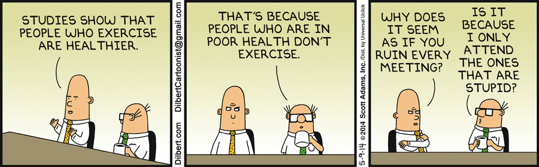
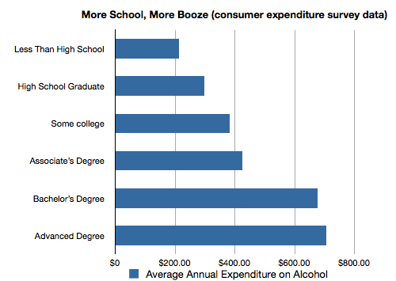
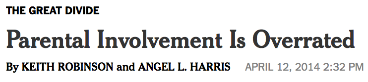
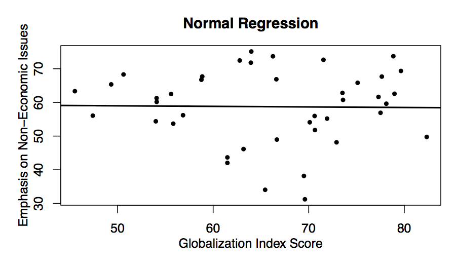
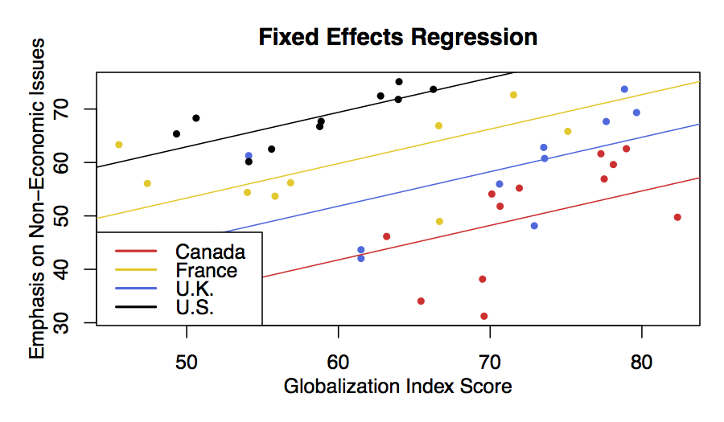
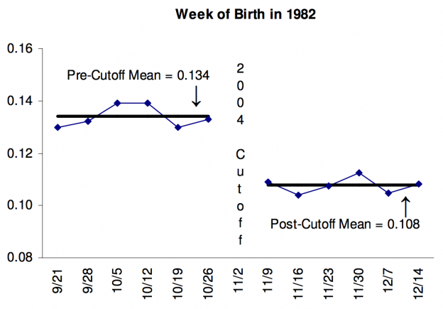

# Causality

## Correlation and causation




What is causality?

1. Understand how social scientists define causation
2. Understand the fundamental problem of causal inference
3. Understand why experiments are social scientists' ideal method of determining causation
4. Understand the term "average treatment effect"
5. Understand the difficulties social scientists face when using correlation in the absence of an experiment to establish causality.
6. Understand how to estimate the causal effect of a (simple) experimental treatment.
7. Get a sense of how this can all get a lot more complicated.

What's the big deal here?

- In many cases we are not interested in describing or predicting.  We are interested in explaining.
- Most of the sort of "why" questions we ask are fundamentally about causal inference.
    * Does income inequality cause political polarization? 
    * Does being democratic make a country less likely to go to war with its neighbors? 
    * Does being appointed by a Republican make a judge more likely to vote consistent with conservative policies?  


So what, exactly, is causation?

- This is actually a deep question, and philosophers still disagree about it.
- But contemporary social science has partially converged on a particular definition often attributed to Rubin/Neyman/Holland.  
- Sometimes also called the "potential outcomes" framework.

---
The parable of the the accident:

Imagine you're driving a car down a four-lane road.  All of the sudden, out of nowhere, a car drives out of its lane, into yours, right in front of your car.  You can tell that the driver is texting, and isn't looking at the road.  You slam on the breaks, and your hood collides with his fender.  Fortunately, you're shaken, but fine, and so is the other driver. Chances are, you will be asking yourselves some questions.  

- Why did that happen?  
- What would have happened if I had been paying more attention to the cars around me? 
- What if that driver hadn't been texting?  

These are causal questions.

What caused our accident?

- The other driver?

- Or maybe the fact the other driver was texting?

- The sky was blue?

- Some can be ruled out by other knowledge.

- One plausible *causal* argument is that **if** the driver had not been texting, the accident would not have happened. 

- This is the kind of reasoning we use when we say that texting while driving **caused** the accident.

- We are comparing what happened (what we observed) to the counterfactual (what would have happened).


## A formal definition

- We say that **X caused Y if Y would not have occured but for X**.
- So we are imagining two worlds:
    - A world where X happens and then we observe Y.
    - A world where X does **not** happen and then we observe Y.
- These are the "potential outcomes."
- And the difference between potential outcomes is the **causal effect** of X.


Go lose yourself in the philisophical background of this debate: 

https://plato.stanford.edu/entries/causal-models/


Example: Did the stimulus package work?

- In 2009, Congress passed a large stimulus package to address the 2008 financial crisis.  

- Many question whether it really had an effect on the economy or unemployment rates.

- What was the causal effect of the stimulus?

- To answer this, we would need to observe two things:
    1. GDP growth/unemployment in the presence of the stimulus package.
    2. GDP growth/unemployment in the absence of the stimulus package.  
    
- The difference between these two is the causal effect of the stimulus.


**The fundamental problem of causal inference**

- Well, there's a pretty big problem here: we only get to observe one timeline.
- The stimulus was passed, and we can *never* know (without some additional assumptions) what would have happened in its absence.
- A huge literature has developed around trying to make clear causal/reasonable/appropriate causal statements while making as few assumptions as possible.


Moving away from the personal

- One approach is to shift to move away from trying to estimate the causal effect of X on all units.
- Instead we estimate the **average treatment effect (ATE)** or one of its cousins.
- The ATE is an **estimate**.  We will talk later about how to **estimate** it.
- The ATE is the **average** difference in potential outcomes across all of your units.  You still can't *observe* it, but it is easier to approximate (estimate) it from the data you observe.

## Formal presentation of an ATE

- Imagine we have a single covariate $T$ that can take on two values $T \in \{0, 1\}$. 

$$\begin{array}{l c c c}
\text{Unit} & y_0 & y_1 & y_1-y_0 \\ 
\hline
1 & 2.4 & 3.2 & 0.8 \\
2 & 42.3 & 40.1 & -2.2\\
3 & 13 & 16.4 & 2.4\\
\vdots &  & & \vdots\\
n & -1.2 & -1.8 & -0.6
\end{array}$$


- The average causal effect would be (under reasonable assumptions): 

$$\text{mean}(y_1-y_0) = \text{mean}(y_1) - \text{mean}(y_0)$$


- The problem is that when we get a *real* dataset it's going to look like this:


$$\begin{array}{l c c c}
\text{Unit} & y_0 & y_1 & y_1-y_0 \\ 
\hline
1 & ? & 3.2 & ? \\
2 & ? & 40.1 & ?\\
3 & 13 & ? & ?\\
\vdots &  & & \vdots\\
n & -1.2 & ? & ?
\end{array}$$


- We will always be missing one of the counterfactual outcomes.
- And the goal of all of almost all approaches to causal inference is to fill in the missing values on this table.


### Danger!

So it turns out that doing this well is pretty hard.  Why?

1. Units where $T=0$ might be fundamentally different than those where $T=1$.  
2. There might be a "lurking variable" that is correlated with both $T$ and $Y$.
3. We can't really measure for all possible lurking variables.


### Does drinking make you more educated?





1. Education $\rightarrow$ Spending more on alcohol
2. Spending more on alcohol $\rightarrow$ Education
3. Income?

### Problem: It can be way more subtle


(Mount 2010)





Rogers, Coffman, and Bergman:


While the authors control for certain variables, their research only implies there is a relationship between parental involvement and student performance. This caveat is important; **the existence of a relationship does not tell us what causes what**.

Think of it this way: **If you had two children, and one was getting A's and the other C's, which of them would you help more? The C student.** An outsider, noticing that you've spent the school year helping only one of your children, might infer that parental help caused that child to earn lower grades. This of course would not be the case, and inferring causation here would be a mistake.

## Estimating ATE

- We've talked about how we can't *know* the causal effect of an intervention on a single unit.
- And we've talked about the ATE.  But how would we go about estimating it?


$$\begin{array}{l c c c}
\text{Unit} & y_0 & y_1 & y_1-y_0 \\ 
\hline
1 & ? & 3.2 & ? \\
2 & ? & 40.1 & ?\\
3 & 13 & ? & ?\\
4 & ? & 18.3 & ?\\
5 & 4.1 & ? & ?\\
6 & -5.1 & ? & ?\\
\end{array}$$


### Filling in the potential values

We are left with essentially two options (with shades of gray in between)

1. We can fill in the missing values (or average values of missing values) of our table using a model.
    - We can try to mine our data in some way to infer values for missing values (or averages of missing values).
    - Mabe we could put extreme bounds on them based on possible (or plausible) values.
    - Maybe even rely on other dependent variables in large/complex systems.
2. We can use our research *design*.
    - We can rely on randomization
    - We can rely on "natural experiments" that help us fill in the missing counterfactuals.

### Good causal inference

$$\begin{array}{l c c c}
\text{Unit} & y_0 & y_1 & y_1-y_0 \\ 
\hline
1 & ? & 3.2 & ? \\
2 & ? & 40.1 & ?\\
3 & 13 & ? & ?\\
4 & ? & 18.3 & ?\\
5 & 4.1 & ? & ?\\
6 & -5.1 & ? & ?\\
\end{array}$$

- An attractive approach here is to try something like this.
    - Take the average of all of the cases where $T=1$
    - Take the average of the cases where $T=0$. 
    - Subtract them.
    
    $$\frac{3.2 + 40.1 + 18.3}{3} - \frac{13+4.1-4.1}{3}$$

- Can we use this to estimate the ATE?
- Yes, but only if:
    - Assignment of T is unrelated to potential outcomes.
    - Units don't affect each other 
    - No hidden variation in treatment

- Hard to do in a lot of settings, but we'll talk about this more next class.
- But much easier to do if we use our old friend randomization.
    

## Experiments: A/B Testing

- Imagine that we had *randomly* assigned each unit to a treatment/control condition.
- Now we know for certain that T and the potential outcomes are independent.
- We can also take steps so that the treatment does not vary in intensity across units (?).
- And in many cases is easy to assure no between-unit contact.
- This all makes causal inference (relatively) easy, and is why randomized controlled trials are considered the gold standard.

Example: Audit studies for employment

```{r, eval=TRUE, message=FALSE, warning=FALSE, fig.width=8, fig.height=7}
resume<-read.csv("../Datasets/resume.csv")
```

Actual link:
http://politicaldatascience.com/PDS/Datasets/resume.csv

- This study sent out resumes for job applications.  
- Everything was the same, except for the first name of the applicant.
- Names were chosen to signal race and gender
    * e.g., Aisha, Allison, Hakim, Brad, Rasheed, Todd, Tanisha, Jill, etc.
- Question: Does the perceived race/gender of the applicant affect the probability that they receive a call?
- Dataset includes four variables:
    - Name: `firstname`
    - Implied gender: `sex`
    - Race: `race`
    - Binary indicator of whether receivd a call: `call`
     
So what was the causal effect?

```{r, eval=TRUE, message=FALSE, warning=FALSE, fig.width=8, fig.height=7}
tapply(resume$call, INDEX=resume$race, FUN=mean)
```

A little over 3%.  


Do this a little easier with:

```{r, eval=TRUE, message=FALSE, warning=FALSE, fig.width=8, fig.height=7}
summary(lm(call~race, data=resume))
```

```{r, eval=TRUE, message=FALSE, warning=FALSE, fig.width=8, fig.height=7}
summary(lm(call~race+sex, data=resume))
```

### What to do when you can't experiment:

- We want to measure the causal effect of some variable $T$ on outcome $Y$.
    
- But what if the cases where $T=0$ are fundamentally different from those where $T=1$?

- Just comparing $\bar{Y} | T=1$ to $\bar{Y} | T=0$ will not give us the causal effect of $T$.  

- More technically, for this to be a valid approach we need (at least):

$$(Y_0, Y_1) \perp T$$
- So what do we do when this isn't true?

We are going to assume:

$$(Y_0, Y_1) \perp T | X$$

How to do that?

- Matching, some forms of marginal structural models, and more.
- The simplest, though, is to just "control for" possible confounding.


$$Y=\beta_0 + \beta_1 T + \beta_2 X + \epsilon$$
$$\epsilon \sim N(0, \sigma^2) $$

- This should look familliar -- multiple linear regression.

- But *if* we have all of the right covariates and *if* we have the right model, then $E(\beta_1) = ATE$.

#### Example: New Hampshire 2008 primary: Clinton vs. Obama

```{r, eval=TRUE, message=FALSE, warning=FALSE, fig.width=8, fig.height=7}
library(faraway)
data(newhamp)
```

N=276 wards in New Hampshire

- **pObama**: Proportion of vote going to Obama
- **votesys**: Hand counted (H) vs. machine count (D)
- **Dean**: Proportion of voters for Howard Dean in 2004
- **pci**: Per capita annual income in USD
- **white**: Proportion white according to 2000 census


Your data science friend says IT'S ALL RIGGED!

```{r, eval=TRUE, message=FALSE, warning=FALSE, fig.width=8, fig.height=7}
summary(lm(pObama~votesys, data=newhamp))
```

Is this the effect of the voting machines?

```{r, eval=TRUE, message=FALSE, warning=FALSE, fig.width=8, fig.height=7}
library(tidyverse)
newhamp %>% group_by(votesys) %>%
  summarize(White = mean(white, na.rm=TRUE), 
            Income=mean(pci, na.rm=TRUE),
            Dean = mean(Dean, na.rm=TRUE))
```

Probably not

```{r, eval=TRUE, message=FALSE, warning=FALSE, fig.width=8, fig.height=7}
summary(lm(pObama~votesys + Dean + white + pci, data=newhamp))
```

```{r, eval=TRUE, message=FALSE, warning=FALSE, fig.width=8, fig.height=7}
congress <- read.csv("https://jmontgomery.github.io/ProblemSets/incumbents.csv")
```

This is a dataset of incumbent members of congress running for election.  The dependent variable of interest is `voteshare`, which is the percent of the two-party vote received by the incumbent.

- Run a regression with `voteshare` as the dependent variable and `incspend` as the explanatory variable.  `incspend` is the amount of money spent by the candidate in the election.  What does the regression result mean?  That is, what would be the naive causal interpretation?
- Is there imbalance in `incspend` depending on the quality of the challenger (`challquality`).  What does that mean for your causal inference?
- Use the variables `chalspend` (spending by the challenger), `presvote` (share of vote going to the candidates' presidential candidate), and `chalquality` to try and "adjust".  


## Panel data and fixed effects


- As the Congress example illustrates, there is a fundamental limit to this kind of strategy.

- We can't always control for everything.  And even if we could, results can become highly model dependent.

- Another approach is to try and collect data on the same units over time.

- We can then try and "control" for factors (even unobserved factors) that make each unit different from the others using **fixed effects**.

    - This is just a fancy way to say we are going to have a different intercept for each unit in our data.

    - Requires we focus only on treatments that change over time.
    
    - If treatment doesn't change (much) will give us a false negative.

### Example: Are elections fought over non-economic issues more when globalization increases?

- Panel data includes repeated observations of Canada, France, the United States and the United Kingdom.  
- We have measures of (a) the degree to which each election is about non-economic issues and (b) level of globalization in the country.
- We want to see if globalization **causes** more focus on non-economic issues.

With no fixed effects:



What does that mean?

- Each dot is an election.
- Across these four countries, there is no relationship.
- But what if allowed for country-level fixed effects?
    * The US and France may just be different on average in how much politics focuses on economics?
    * So we have an "intercept shift"

With fixed effects:




### Naive regression
```{r, eval=TRUE, message=FALSE, warning=FALSE, fig.width=8, fig.height=7}
library(AER)
data("Fatalities")
Fatalities$fatal_rate <- Fatalities$fatal / Fatalities$pop * 10000
summary(lm(fatal_rate ~ beertax, data=Fatalities))
```

### Fixed effects

The term that allows for the fixed effects in the `lm` call is the $-1$
```{r, eval=TRUE, message=FALSE, warning=FALSE, fig.width=8, fig.height=7}
model2<-summary(lm(fatal_rate ~ beertax + state - 1, data=Fatalities))
head(model2$coefficients)
```


## Difference-in-differences


- Difference-in-differences (DID) is an empirical strategy used to make claims of causal inference. 
- A researcher considers some intervening factor (the introduction of a policy, a stock market shock, a terrorist attack, etc.) and seeks to prove that factor to be the cause of some outcome (bank closures, casualties, vote share, etc.).


Let's consider the task of estimating the effect of closing early-voting voting precincts in 17 counties in North Caroilna had on turnout in 2016.

(1) Identify the population (A) to which the intervention was applied and identify a comparable population (B) to which the intervention was NOT applied. 
  
In our example, we would divide all 100 counties in North Carolina into 

- group A, counties where early voting precincts were reduced, and 
- group B, counties where the number of early voting precincts was kept the same.


(2) Identify the outcome of interest of both populations before and after the intervention (A-pre, A-post, B-pre, B-post).  
- This means we need to know the  turnout rate for all counties in group A before the reform (e.g., in 2012) and after the reform (e.g., in 2016).  
- Likewise, we need to calculate the turnout rate in for counties in group B before the reform (2012) and after the reform (2016).

(3) Find D1: the difference between A-pre and B-pre.  
- This would be difference in the average turnout rate between group A and group B in 2012.  

(4) Find D2: the difference between A-post and B-post. 
- This would be the difference in the average turnout rate between group A and gropu B in 2016.


(5) Calculate D2 minus D1 to find the difference-in-differences (DD). This would be a measure of how the differences between turnout rates in group A and B changed as a result of the closed precincts.


Here's a visual illustration of how this research strategy works:


### DID in practice

- A series of train bombings in Madrid on March 11, 2004 left 191 people dead and 1,500 injured. 
- In the Spanish congressional elections which took place three days later, the Socialist party defeated the Conservative party. 
- Did the terrorist attack increase the Socialist party's vote share? 

Identifying our treatment/control group:

- Voters living outside of Spain voted earlier, while Spanish residents voted on election day.
- These groups are not the same, but could we assume a parallel trend? Are they consistently different?


How to do it?


Respndent ID#	|Voted Conservative (Y) |	Treatment group (X1)|	Post-treatment (X2) |	Treatment AND Post (X1 x X2) |
-|-|-|-|-|
1001|	0	|0	|0	|0|
1002|0	|1	|1	|1|
1003|	1	|1	|1	|1|
1004|	0	|1	|0	|0|
1005|	1 |	0	|1	|0|
1006|	1 |	0	|0	|0|
1007|	0	|0	|1	|0|
1008|	1	|0	|1	|0|

$$Y = \beta_0 + \beta_1X_1 + \beta_2X_2 + \beta_3(X_1 \times X_2) + \epsilon$$


1. One variable indicates whether or not respondents are affected by the treatment.
2. One variable indicates whether pre-post treatment.
3. One variable is the interaction.
    - This is our treatment effect
    - Effect of the treatment on the treated (ATT)

### Regression discontinuity

- In many cases interventions occur at a discontinuity.
- Maybe only students above a specific score get free college?
- Maybe only politicians who win the most votes get into office?
- Regression discontinuity seeks to:
    - Compare respondents just above this cutoff to
    - Individuals just below this cutoff 


#### Example: Is voting a habit?

- Some have argued that voting can be habitual
- Prof. Marc Meredith tested this using data from California.
- He looked at the turnout rates in the 2006 election for people around the voting eligibiltiy threshold for the 2004 election.  




So how to do that?

- Well ... that's not so easy.
- In essence we want to compare means just to the left and just to the right.
- But what if there is a "trend" on the left/right?
    - A more advanced class would take you through this.
    - But, in essence, fit a "smooth" function to the left and right.

A simpler version

$$y= \beta_0 + \beta_1 X + \beta_2*I(X>D) + \epsilon$$

$I(x)$ is an indicator function. That means that it has the value 1 when $x$ is true and 0 otherwise.

- This is fitting single regression where $y$ is a funciton of $x$.
- BUT, you allow an intercept shift for before/after the discontinuity.

The basic components:

- $Y$: An outcome variable (violence at $t+1$)
- $X$: A variable that determines the cutoff (violence at $t$)
- $D$: A cutoff/threshold
- Does the relationship between $Y$ and $X$ "shift" right at $D$? 

$$y= \beta_0 + \beta_1 X + \beta_2*I(X>D) + \epsilon$$


