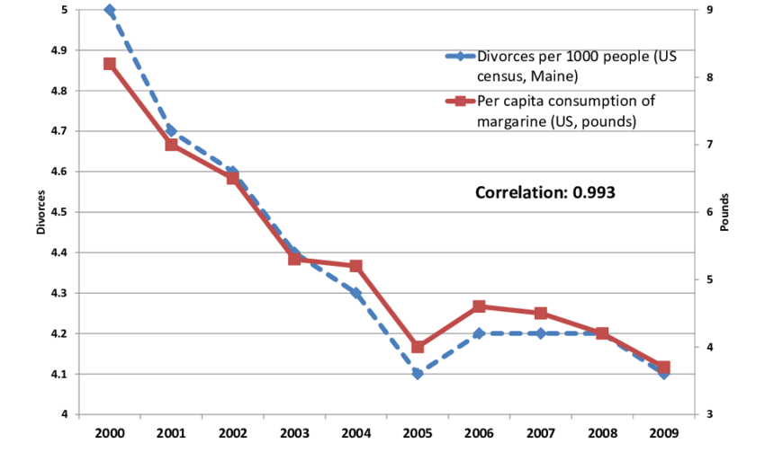

```{r opts, echo = FALSE}
knitr::opts_chunk$set(
  fig.path = "images/"
)
```

# Don't be a clown

> Pollsters are wizards, shamans, diviners. They toss numbers around the way astragalomancers once tossed bones to foretell events to come. (The name comes from the Greek astragalos, meaning “knucklebone.” But you knew that.) <br>

> I have never been called by a political pollster and don’t know anybody who has, but I know some pollsters, who assure me they don’t make the numbers up, and I believe them.<br>
<br>
<br>
--- Roger Simon, Chief Political Columnist, *Politico*


[Link](https://www.politico.com/story/2011/12/are-polls-really-magic-070717) 


Depending on who you listen to, artificial intelligence and machine learning^[Machine learning and statistics is really just a subset of artificial intelligence (AI) research.  For fun, just start telling people you are in an AI class and see how they react.] are either the cause or the solution to all of the world's problems.  On the one hand you have algorithms spreading misinformtion, large scale corporate surveillance, and predicted mass unemployment in the service sector.  On the other hand you have ever-improving health diagnostics, data-driven journalism, and all the world's information at the touch of your fingers (or voice).

The term "data science" means different things to different people, but for most people the term doesn't mean much at all. In the two quotes above, we see both the Insane Clown Posse and Politico's (for God's sake) chief political columnist share a loving embrace with ignorance about fundamental forces in our life.  We swim in data and statistics.  News, politics, and policy is increasingly being driven by data and algorithms.  But all too few people know much about how these algorithms work. Like magnets or random sampling, data science is just a mysterious force that we have to cope with.

The central goal of this class is to make sure you don't have to be a clown.  In today's world, your future career will surely 

You will find that data science, machine learning, big data, and artificial intelligence is just another tool (if a powerful tool).  It is neither good nor evil by itself.  It is humans and human judgement (or lack of judgement) that lead to good our bad outcomes.  

But whether you intend to work for the forces of good or evil (I tend towards chaotic neutral)


## As easy as cake

One way 


### Coding


### Data acquision 

Is that polling data you are looking at a random sample of Americans, or just everyone who attended that sick Delta Sig party?  Were the people in your data randomly assigned to watch Fox news, or did they choose to?  

No matter how fancy your machine learning algorithm, the results don't mean anything very much if you don't 


### Algorithms


### Domain knowledge


Like baking, the final thing you need to do good data science is what most people call "domain knowledge" and what I call "knowing what the hell you are talking about."  It turns out that having a really cool statistical model, huge amounts of data, and even a super computer sproting 24 GPUs will not save you from reaching the wrong answer if you don't think (and aren't trained to think).  


[Link](https://www.researchgate.net/figure/A-famous-spurious-correlationstylervigencom_fig3_316739091)

### Putting it together


A final method.  You can get along fine in may cases following the instructions on the back of the chocolate chip cookie bag.  But to really become a "baker" you need to be able to create your own recipes for each occasion.  And to do that you actually need to "know what the hell you are talking about."

So 


## Class structures


### Learning objective #1: Team based learning

This course was designed to incorporate elements of Team Based Learning. This is an approach to creating permanent groups to work on problems in class and out of class throughout the semester.  

We are not going to follow the TBL approach strictly. But we are going to have fewer lectures and more structured group activities.  Learn more about Team Based Learning by watching this video.

<iframe width="560" height="315" src="https://www.youtube.com/embed/kxg5FTGZhZs" frameborder="0" allow="accelerometer; autoplay; encrypted-media; gyroscope; picture-in-picture" allowfullscreen></iframe>


### Learning objective #2: Show up ready

Moving an increasing amount of teaching resources online is a big trend in education at all levels.  But this isn't just trendy, it appears to be very effective. Preliminary research shows that online learning paired with in-class interactions with faculty is a much more effective than the traditional lecture format.

Watch this short TED talk by Peter Norvig to learn more:

<iframe width="560" height="315" src="https://www.youtube.com/embed/tYclUdcsdeo" frameborder="0" allow="accelerometer; autoplay; encrypted-media; gyroscope; picture-in-picture" allowfullscreen></iframe>
So in advance of each lecture


### Learning objective #3:  How is this going to work?

The approach I am trying to adopt for this class is to help you learn in four basic steps.  

1. Initial exposure to materials through self-study.

2. Repeated exposure to materials in short lectures.

3. Use your new knowledge in a collaborative environment where assistance is readily available.

4. Use your new knowledge on your own.

The goal is for you to see and use information in multiple ways to improve learning outcomes.  Experience (and research) shows that this approach is far superior to simple lectures in helping you learn more and retain it longer.  To help you along this process, each learning component will be broken down as follows.

1. You will read your book and review online materials. 

2. I will begin most classes with a short lecture where I will cover the materials again and answer questions.

3. You will apply your knowledge during in-class team assignments.  If you have any questions or run into problems, I will be right there to give you help.  To keep the team motivated, these assignments will be graded.

4. You will apply your knowledge on your own (or with friends) in your problem sets and final project.


## Interactive R Environment (not currently working)

You might want to bookmark this page to test code quickly without opening RStudio.

The username is the first name of the professor of this course and the password is the last name of the professor of this course
```{r, echo=F}
# runGist("e600b55b64cd2fc067e20622f5efc2ff")
```
