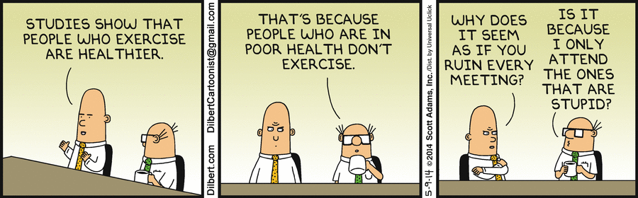
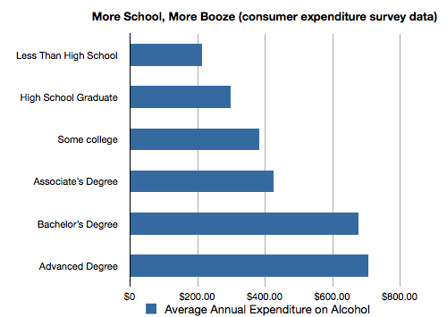
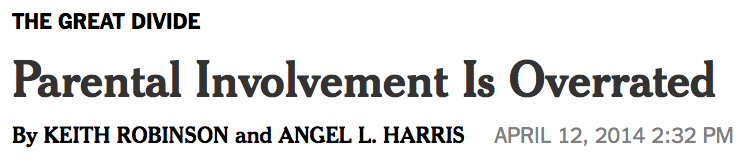
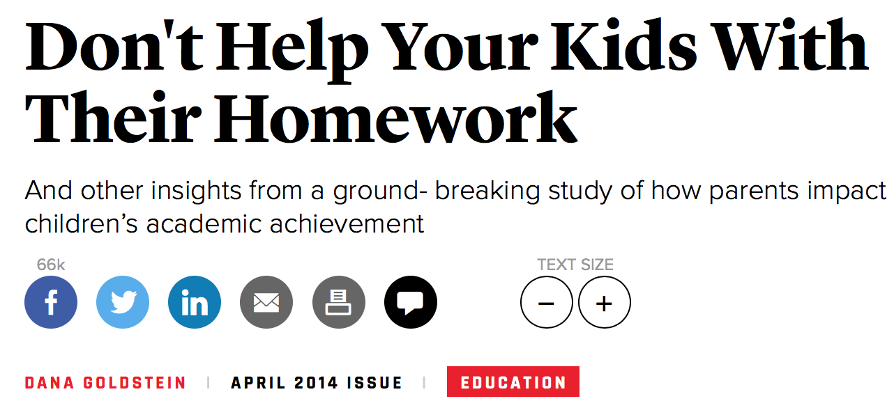

<style type="text/css">
body, td {
   font-size: 14px;
}
code.r{
  font-size: 14px;
}
pre {
  font-size: 4px;
}
</style>


## Orientation for this component

Last time


1. Supervised learning 2
    + Classification and linear classifiers
    + Fit statistics/Diagnostics
    + Trees and neighbors


--

This time

1. Causality 1
    + Thinking in counterfactuals
    + Experimental design


--

Next time

1. Causality 2
  + Basic approaches when experiments are not possible.
  + Difference-in-differences
  + Regression discontinuity


---
## Correlation and causation


--





---
## Goals for today

- Thinking about causality
- Average treatment effects
- Don't be evil.  And it's so easy to be evil.


---
## What is causality?

1. Understand how social scientists define causation
2. Understand the fundamental problem of causal inference
3. Understand why experiments are social scientists' ideal method of determining causation
4. Understand the term "average treatment effect"
5. Understand the difficulties social scientists face when using correlation in the absence of an experiment to establish causality.
6. Understand how to estimate the causal effect of a (simple) experimental treatment.
7. Get a sense of how this can all get a lot more complicated.


---
## What's the big deal here?


- In many cases we are not interested in describing or predicting.  We are interested in explaining.
- Most of the sort of "why" questions we ask are fundamentally about causal inference.
    * Does income inequality cause political polarization? 
    * Does being democratic make a country less likely to go to war with its neighbors? 
    * Does being appointed by a Republican make a judge more likely to vote consistent with conservative policies?  


---
## So what, exactly, is causation?

- This is actually a deep question, and philosophers still disagree about it.
- But contemporary social science has partially converged on a particular definition often attributed to Rubin/Neyman/Holland.  
- Sometimes also called the "potential outcomes" framework.

---
### The parable of the the accident

> Imagine you're driving a car down a four-lane road.  All of the sudden, out of nowhere, a car drives out of its lane, into yours, right in front of your car.  You can tell that the driver is texting, and isn't looking at the road.  You slam on the breaks, and your hood collides with his fender.  Fortunately, you're shaken, but fine, and so is the other driver. Chances are, you will be asking yourselves some questions.  

- Why did that happen?  
- What would have happened if I had been paying more attention to the cars around you? 
- What if that driver hadn't been texting?  


--

These are causal questions.


---
## What caused our accident?

- The other driver?

- Or maybe the fact the other driver was texting?

--

- The sky was blue?


- Some can be ruled out be other knowledge.


---

- One plausible *causal* argument is that **if** the driver had not been texting, the accident would not have happened. 

- This is the kind of reasoning we use when we say that texting while driving **caused** the accident.

--

- We are comparing what happened (what we observed) to the counterfactual (what would have happened).


---

## A slightly more formal definition

- We say that **X caused Y if Y would not have occured but for X**.
- So we are imagining two worlds:
    - A world where X happens and then we observe Y.
    - A world where X does **not** happen and then we observe Y.
- These are the "potential outcomes."
- And the difference between potential outcomes is the **causal effect** of X.

---
## End of Part A

Go lose yourself in the philisophical background of this debate: 

https://plato.stanford.edu/entries/causal-models/


---
## Did the stimulus package work?

- In 2009, Congress passed a large stimulus package to address the 2008 financial crisis.  

- Many question whether it really had an effect on the economy or unemployment rates.

- What was the causal effect of the stimulus?

--

- To answer this, we would need to observe two things:
    1. GDP growth/unemployment in the presence of the stimulus package.
    2. GDP growth/unemployment in the absence of the stimulus package.  
    
--

- The difference between these two is the causal effect of the stimulus.


---
## The fundamental problem of causal inference

- Well, there's a pretty big problem here: we only get to observe one timeline.
- The stimulus was passed, and we can *never* know (without some additional assumptions) what would have happened in its absence.
- A huge literature has developed around trying to make clear causal/reasonable/appropriate causal statements while making as few assumptions as possible.


---
## Moving away from the personal

- One approach is to shift to move away from trying to estimate the causal effect of X on all units.
- Instead we estimate the **average treatment effect** or one of it's cousins.
- The ATE is an **estimand**.  We will talk later about how to **estimate** it.
- The ATE is the **average** difference in potential outcomes across all of your units.  You still can't *observe* it, but it is easier to approximate (estimate) it from the data you observe.

---
## More formal presentation of an ATE

- Imagine we have a single covariate $T$ that can take on two values $T \in \{0, 1\}$. 

$$\begin{array}{l c c c}
\text{Unit} & y_0 & y_1 & y_1-y_0 \\ 
\hline
1 & 2.4 & 3.2 & 0.8 \\
2 & 42.3 & 40.1 & -2.2\\
3 & 13 & 16.4 & 2.4\\
\vdots &  & & \vdots\\
n & -1.2 & -1.8 & -0.6
\end{array}$$

--

- The average causal effect would be (under reasonable assumptions): 

$$\text{mean}(y_1-y_0) = \text{mean}(y_1) - \text{mean}(y_0)$$


---
### Still not there

- The problem is that when we get a *real* dataset it's going to look like this:


$$\begin{array}{l c c c}
\text{Unit} & y_0 & y_1 & y_1-y_0 \\ 
\hline
1 & ? & 3.2 & ? \\
2 & ? & 40.1 & ?\\
3 & 13 & ? & ?\\
\vdots &  & & \vdots\\
n & -1.2 & ? & ?
\end{array}$$

--

- We will always be missing one of the counterfactual outcomes.
- And the goal of all of almost all approaches to causal inference is to fill in the missing values on this table.


---
## Danger!

So it turns out that doing this well is pretty hard.  Why?

1. Units where $T=0$ might be fundamentally different than those where $T=1$.  
2. There might be a "lurking variable" that is correlated with both $T$ and $Y$.
3. We can't really measure for all possible lurking variables.


---
## Does drinking make you more educated?





--

1. Education $\rightarrow$ Spending more on alcohol
2. Spending more on alcohol $\rightarrow$ Education
3. Income?

---
## Problem: It can be way more subtle


(Mount 2010)

---






---


Rogers, Coffman, and Bergman:


> While the authors control for certain variables, their research only implies there is a relationship between parental involvement and student performance. This caveat is important; **the existence of a relationship does not tell us what causes what**.

> Think of it this way: **If you had two children, and one was getting A's and the other C's, which of them would you help more? The C student.** An outsider, noticing that you've spent the school year helping only one of your children, might infer that parental help caused that child to earn lower grades. This of course would not be the case, and inferring causation here would be a mistake.


---
### More seriously


- Vitamin C? 

--


- Hormone replacement?

--


- Gluten? 

--

- Drinking while pregnant?

--

- Fox News?


---
## Pundits gotta pundit

- Go check out some news content (especially editorial pages) and find an example of someone making a causal claim.
- What are they using to fill in these counterfactuals?  What evidence to they bring to bear?
- Put your example up on slack.  The goal here is to find the **WORST** approach to causal inference you can.
- Don't spend more than 5 minutes on this.


---
## End of Part B


---

### Where do we go from here?

- We've talked about how we can't *know* the causal effect of an intervention on a single unit.
- And we've talked about the ATE.  But how would we go about estimating it?


$$\begin{array}{l c c c}
\text{Unit} & y_0 & y_1 & y_1-y_0 \\ 
\hline
1 & ? & 3.2 & ? \\
2 & ? & 40.1 & ?\\
3 & 13 & ? & ?\\
4 & ? & 18.3 & ?\\
5 & 4.1 & ? & ?\\
6 & -5.1 & ? & ?\\
\end{array}$$


---
### Filling in the potential values

We are left with essentially two options (with shades of gray in between)

1. We can fill in the missing values (or average values of missing values) of our table using a model.
    - We can try to mine our data in some way to infer values for missing values (or averages of missing values).
    - Mabe we could put extreme bounds on them based on possible (or plausible) values.
    - Maybe even rely on other dependent variables in large/complex systems.
2. We can use our research *design*.
    - We can rely on randomization
    - We can rely on "natural experiments" that help us fill in the missing counterfactuals.


---
## Getting to good causal inference

$$\begin{array}{l c c c}
\text{Unit} & y_0 & y_1 & y_1-y_0 \\ 
\hline
1 & ? & 3.2 & ? \\
2 & ? & 40.1 & ?\\
3 & 13 & ? & ?\\
4 & ? & 18.3 & ?\\
5 & 4.1 & ? & ?\\
6 & -5.1 & ? & ?\\
\end{array}$$

- An attractive approach here is to try something like this.
    - Take the average of all of the cases where $T=1$
    - Take the average of the cases where $T=0$. 
    - Subtract them.
    
    $$\frac{3.2 + 40.1 + 18.3}{3} - \frac{13+4.1-4.1}{3}$$

---

- Can we use this to estimate the ATE?
- Yes, but only if:
    - Assignment of T is unrelated to potential outcomes.
    - Units don't affect each other 
    - No hidden variation in treatment

--

- Hard to do in a lot of settings, but we'll talk about this more next class.
- But much easier to do if we use our old friend randomization.
    


---
## Experiments A/B Testing

- Imagine that we had *randomly* assigned each unit to a treatment/control condition.
- Now we know for certain that T and the potential outcomes are independent.
- We can also take steps so that the treatment does not vary in intensity across units (?).
- And in many cases is easy to assure no between-unit contact.
- This all makes causal inference (relatively) easy, and is why randomized controlled trials are considered the gold standard.

---
## Example: Audit studies for employment

```{r, eval=TRUE, message=FALSE, warning=FALSE, fig.width=8, fig.height=7}
resume<-read.csv("~/Github/jmontgomery.github.io/PDS/Datasets/resume.csv")
```

Actual link:
http://politicaldatascience.com/PDS/Datasets/resume.csv

- This study sent our resumes for job applications.  
- Everything was the same, except for the first name of the applicant.
- Names were chosen to signal race and gender
    * e.g., Aisha, Allison, Hakim, Brad, Rasheed, Todd, Tanisha, Jill, etc.
- Question: Does the perceived race/gender of the applicant affect the probability that they receive a call?
- Dataset includes four variables:
    - Name: `firstname`
    - Implied gender: `sex`
    - Race: `race`
    - Binary indicator of whether receivd a call: `call`
     

---
## So what was the causal effect?


```{r, eval=TRUE, message=FALSE, warning=FALSE, fig.width=8, fig.height=7}
tapply(resume$call, INDEX=resume$race, FUN=mean)
```

- A little over 3%.  


---


Do this a little easier with:

```{r, eval=TRUE, message=FALSE, warning=FALSE, fig.width=8, fig.height=7}
summary(lm(call~race, data=resume))
```


---

```{r, eval=TRUE, message=FALSE, warning=FALSE, fig.width=8, fig.height=7}
summary(lm(call~race+sex, data=resume))
```

---
## Now over to you

- Go back to Lecture 16 and use those instructions to create a 95\% confidence interval for the race treatment.
- (Optional) See if you can do the same thing by bootstrapping.
    - Sample from the data with replacement.
    - Fit the regression
    - Save the coefficient of interest.  So if you do 200 bootstrapped re-samplings, you'll end up with 200 coefficients.
    - Now calculate the standard deviation (use the `sd` function) of those stored coefficients.  This is your bootstrapped standard error.
    - Re-calcualte the 95% confidence interval. 
- Put both into the Slack channel for this lecture.


---
## End of Part C


---

## Notes on experiments

- When designed well, analysis is easy.  

--

- But lot's of problems require more careful thinking:
    - Clustering
    - Attrition
    - Non-complience
    - Mediation?
    - Moderation

--

- Ethics? 
    - NICU
    - Alcohol for pregnant women

- Importance?
    - War, election outcomes, etc.
    - Can you think of things that are of core importance to social science where an acutal experiment would be appropriate?
    
--

- But it can be a powerful framework, especially when you realize that a lot of things are "randomized" even if it's not called an experiment.

---

## Group project

Chattopadhyay and Duflo were interested in studying the causal effect of having female politi- cians on policy outcomes. Do women promote different policies than men? Answering this question with observational data is pretty difficult due to potential confounding problems (e.g. the districts that choose female politicians are likely to systematically differ in other aspects too). Hence, they exploit a randomised policy experiment in India, where since the mid-1990s, 1/3 of village council heads have been randomly reserved for women. 

A subset of the data from 
West Bengal can be found at the following link: https://raw.githubusercontent.com/kosukeimai/qss/master/PREDICTION/women.csv

Each observation in the data set represents a village and there are two villages associated with one GP (i.e. a level of government called GP). The next slide shows the names and descriptions of the variables in the “women.csv” dataset. They hypothesize that female politicians are more likely to support policies female voters want. Researchers found that more women complain about the quality of drinking water than men. 

---

## Assignment

**Your job**: Estimate the effect of the reservation policy on the number of new or repaired drinking water facilities in the villages.  Be sure to include a 95% confidence interval. Props (but no points) for using bootstrapped standard errors.


- **GP**: A unique identifier for each Gram Panchayat (GP)
- **village**: A unique identifier for eah village
- **reserved**: A binary varible indicating whether the GP was reserved for women leaders or not.
- **irrigation**: variable measuring the number of new or reparied irrigation facilities.
- **water**: variable measuring the number of new or repeared drinking-water facilities in the village (this is your DV)


