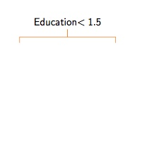
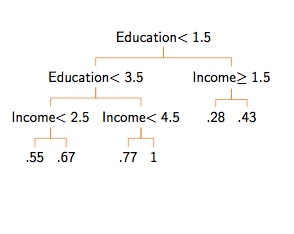

<style type="text/css">
body, td {
   font-size: 14px;
}
code.r{
  font-size: 14px;
}
pre {
  font-size: 4px;
}
</style>


## Orientation for this component

Last time


1. Introduction to machine learning:
    + Basic idea
    + Basic problems
    + Example: Prediction of presidential elections
    + Signal or noise?: Cross validation

--

This time

1. Supervised learning 2
    + Classification and linear classifiers
    + Fit statistics/Diagnostics
    + Trees and neighbors


--

Next time

1. Causality 1
    + Thinking in counterfactuals
    + Experimental design


---
## Classification: A special type of function


- Last time we talked about thinking about machine learning as finding a function that maps from features to outcomes

$$y \sim f(X)$$
- The *regression* model we used last time was for:
    * A continous outcome
    * An outcome where $y$ can take on any value between $\infty$ and $-\infty$.
    
--

- But in many cases $y$ is constrained
    - For vote share, we might want to constrain to be between 0 and 1? (A proportion)
    - For categorical outcomes, we might want to constrain $y$ to be just 0 or 1. (Binary)
  
  
--

- We'll call the case of trying to put $y$ into discrte bins a *classifier*.

---
## Classification basics: Binary outcomes

- The difference between regression and classification is that we look at a special type of function, $f(X)$.

--

- We want a function that will:
    - Take in a set of features $X$ that can take on all kinds of values (binary, continuous, etc.)
    - But it will "squash" all of these features so that $f(X) \in [0, 1]$.  
    - We then say that the probability that $y=1$ is equal to $f(x)$, or 
    $$Pr(y=1) = f(x)$$
- Intuitively, we are imagining the DGP as a weighted coin flip where the pobability of a "success" is determined by $f(x)$.

---
## Motivating example: Turnout in the 2008 election

- Imagine we are trying to build a model to predict turnout (0 or 1)
- We have the following features:
    * State
    * Ethnicity (White/Black/Hispanic/Other)
    * Age (Divided into quartiles)
    * Income (Divided into quitiles)

```{r, eval=TRUE, message=FALSE, warning=FALSE}
turnout<-read.csv("http://politicaldatascience.com/PDS/Datasets/SimpleTurnout2008.csv")
dim(turnout)
```


---
## The linear classifier (AKA Logit)

- Logit is a member of a family of models called a "generalized linear model"
- These models have two basic parts:
    - A *linear* component
    - A *squashing* component

---
## The linear part

We might for instance, set up an equation of:

$$\Lambda=\beta_0 + \beta_1 \text{Income}+ \beta_2 \text{Age}$$

- This is the same basic idea as normal regression models.
- But this linear combination can take on any value between $-\infty$ and $\infty$ (depending on what the $\beta$ values are)

--

> Example: What's $\Lambda$ here?

- $\beta_0 = 16$
- $\beta_1=2$
- $\beta_2 = 1.5$
- Income = 2
- Age = 2

$$23 = 16 + 2\times 2 + 1.5\times2$$


---
## The squashing part

- But we can't use numbers like 23 to talk about turnout directly.  

- And there is nothing keeping this from evaluating to -200 or 3,272

- So the strategy will be to push $\Lambda$ through a squasher

--

- These are often shaped like an "s", and are sometimes called a *sigmoid*.

- I am going to notate this as $\sigma(\cdot)$

$$f(X) = \sigma(\Lambda)$$

---
## The logistic squasher

- A very common choice for $\sigma(\cdot)$ is the logistic function:

$$\sigma(\Lambda) = \frac{1}{1+\exp(-\Lambda)} = \frac{\exp(\Lambda)}{1+\exp(\Lambda)}$$

```{r, eval=TRUE, message=FALSE, warning=FALSE, fig.width=8, fig.height=4}
myLogistic<-function(Lambda){
  return(1/(1+exp(-1*Lambda)))
}
testValues<-seq(-8, 8, by=.1)
plot(testValues, myLogistic(testValues), type="l", ylab="Pred. Prob.")
```

---
## So let's take a minute

- Use the function on the last slide and assume that:

$$\Lambda = -2 + (1 \times \text{Income}) + (0.7\times \text{Age})  $$

- What is $\Lambda$ when Income=2 and Age=4?
- Put that through our squasher and tell me what the predicted probability will be.
- Do both calculations again but now assume Income=4 and Age=4

--

- So do the linear part first to get $\Lambda$.
- Then use the function I gave you on slide 9 to calculate the predicted probability.


---
## End Part A


---
## The linear classifier in theory

- Remember what we are trying to do: find some function $f(X)$.
- We have a linear portion like $\beta_1 \text{Income}+ \beta_2 \text{Age}$
- We put it through a squasher like the logistic function on Slide 9.
- When we combine this we get:

$$Pr(y=1) = \frac{\exp(\beta_0 + \beta_1 \text{Income}+ \beta_2 \text{Age})}{1+\exp(\beta_0 + \beta_1 \text{Income}+ \beta_2 \text{Age})} $$
--

- But how do we figure out the $\beta$ coefficients?

---
##The linear classifier in practice

- For this class we'll use something maximum likelihood estimation.
- Basically, the computer will find the values of $\beta$ that minimize a specific form of loss
- All you really need to know is how to do it.
    * We use the `glm` function.
    * We specify that the data is binary by using the `family="binomial"` argument.

---

```{r, eval=TRUE, message=FALSE, warning=FALSE, fig.width=8, fig.height=4}
Model1<-glm(turnout ~ inc + age, family="binomial", data=turnout)
summary(Model1)
```

---

## A couple of takeaways

- The Coefficients reported here are from the linear part of the model.
    * You want to focus on the sign of the coefficients
    * And again you can get standard errors and p-values 
- The AIC number is a fit statistic, and we want it to be small (but hard to interpret)
- We can use the same `predict` approach we used before.
    * If we don't specify new data, it generates "in sample" predictions.
    * You want to use the option `type` to make sure you get the predicted probability part back and not the linear part.

```{r, eval=TRUE, message=FALSE, warning=FALSE, fig.width=8, fig.height=4}
Model1preds<-predict(Model1, type="response")
```

---

Let's look at the predicted probabilities for each value of Age in the dataset.

```{r, eval=TRUE, message=FALSE, warning=FALSE, fig.width=8, fig.height=7}
boxplot(Model1preds~turnout$inc, xlab="Income", ylab="Predicted Probabilities")
```

---
## Now it's your turn

- Fit your own linear classifier to this data using the data I've provided.
- You might try some new variables or even recoding a covariate if you want.
- Look at the output and make sure you understand what the coefficients are telling you (more or less).

---
## End Part B


---
## Fit statistics

- When we talked about regression, I emphasized the importance of out-of-sample testing to keep from "overfitting the data."
    - Complex models might seem to fit the data well, but do poorly out of sample.
    - Ths reflects a model that is confusing the "systematic" part of the data with the "error" part of the data.
- I introduced RMSE as a metric.  But what should we use for binary cases?

---

- There are a lot of choices here, and this is again a large topic I will only touch on.
- The easiest place to start is a "confusion matrix"

$$\begin{array}{lcc}
& \text{Truth=0} & \text{Truth=1}\\
\text{Prediction = 0} & \text{True negatives} & \text{False negatives}\\
\text{Prediction = 1} & \text{False positives} & \text{True Positives}\\
\end{array}$$

--

- The diagnonal of this matrix are your correct predictions.
- Should you weight positives or negatives more?
    - Depends on the context
    - You will want to balance or weight.
    
---

- One appproach is to look at precision and recall
    - **Precision** $$\frac{\text{True positives}}{\text{True positives + False positives}}$$
    - **Recall** $$\frac{\text{True positives}}{\text{True positives + False negatives}}$$

- You can also recombine these in a bunch of ways to get things like false discovery rate, specificity, sensitivity, F1 scores, and more.

---
## Brier scores

- Another one is called the Brier Score, which is just RMSE.  Let $p_i$ be our predicted probabilty for unit $i$.

$$\sqrt{\frac{\sum_i^n{(y_i-p_i)^2}}{n}}$$

---
## Going back to turnout


```{r, eval=TRUE, message=FALSE, warning=FALSE, fig.width=8, fig.height=7}
binaryPred<-(Model1preds>0.5)*1
table(binaryPred, turnout$turnout)
```

- This is the confusion matrix where columns are the "truth" and rows are the predictions
- On your own, calculate the precision, recall, and accuracy (the percent of observations this model gets right)
- Put what you got into the slack channel for this lecture.  Make sure you know how to get the same answer as the rest of the class.


---
## End of Part C


---
## More models

- Of course, logistic regression is only one way to build $f(X)$. There are many more.
- Today I'll introduce two pretty easy ones:
    - Tree models
    - K-nearest neighbors
--

- Others you might look into include support vector machines, naive Bayes classifiers, neural networks, Gaussian process regression, and much, much, more.

---
## Tree models


---


  


--

  

---


  


--


  


---

## A final tree model


  


---

## Let's try our own tree

```{r, eval=TRUE, message=FALSE, warning=FALSE, fig.width=8, fig.height=7}
library(rpart)
equation<-as.formula("turnout~eth+inc+age")
tree_mod1<-rpart(equation, data=turnout)
```


---
```{r, eval=TRUE, message=FALSE, warning=FALSE, fig.width=8, fig.height=7}
tree_mod1
```

- This tells us how the tree is constructed
- Better to look at it visually

---

```{r, eval=TRUE, message=FALSE, warning=FALSE, fig.width=10, fig.height=8}
plot(tree_mod1)
text(tree_mod1, use.n=TRUE, all = TRUE, cex=0.8)
```


---
## Tuning parameters

- Many ML models have *tuning parameters*, sometimes called *hyperparamaters* or *hyperpriors*.
- These are parameters that control how the function, but which typically are not estimated from the data.
- These are set by the analyst, often using some sort of cross-validation.
- Most often, these parameters control model complexity.


---


```{r, eval=TRUE, message=FALSE, warning=FALSE, fig.width=8, fig.height=7}
tree_mod2<-rpart(equation, data=turnout, control=rpart.control(cp=.0002))
plot(tree_mod2)
text(tree_mod1, use.n=TRUE, all = TRUE, cex=0.7)
```

---
## Complex or simple

```{r, eval=TRUE, message=FALSE, warning=FALSE, fig.width=8, fig.height=7}
treePreds1<-predict(tree_mod1); treePreds2<-predict(tree_mod2)
```

- Compare the accuracy of these two models using a confusion matrix.
- Do the same use the Brier score
- Now make your own tree using a different value of `cp`.  
- Post your confusion matrix and Brier score up on Slack.

---
## End of Part D


---
## Random forests

- These models actually do not end up performing that well.
- Especially when the relationship between variables is smooth and not discontinuous.
- And they can be very sensitive to seemingly small changes to the data.


---


  

  

 


---

## Intuition for random forests

- One idea is to take advantage of this sensitivity by *bootstrapping* the sample to create many trees and average their predictions for each unit.
- Does better with smooth, additive functions, and on the whole less sensitive to small changes in the data.
- The model will:
    * Randomly selecting rows of the data with replacement.
    * Randomly selecting `mtry` variables from the dataset
    * Build a tree
    * Do this `ntree` times and average the results


---
## Implementation for random forests

```{r, eval=TRUE, message=FALSE, warning=FALSE, fig.width=8, fig.height=7}
library(randomForest)
turnout$turnout<-as.factor(turnout$turnout) # Leave as continuous for regression
mod1_forest<-randomForest(equation, data=turnout, 
                          ntree=201, mtry=2)
mod1_forest # This confusion matrix is "out of bag"
```


---


## Your turn

- Make your own Random Forest model and mess with options:
    * `mtry`
    * `ntree`
    * `maxnodes`
- Put in your confusion matrix into the Slack channel for this class


---
## End Part E


---
## K Nearest Neighbors

- Another simple approach is just to look at observations that are "near" eachother.
- "Near" here just means that they have a similar in terms of their predictor variables.


---
## Putting that in action

- Weird problem in this data is that there can be too many ties.  
- So many observations share the same value.
- So (just for this example) I'll add a bit of noixse


```{r, eval=TRUE, message=FALSE, warning=FALSE, fig.width=8, fig.height=7}
library(class)
turnoutX<-turnout[,c("eth", "inc", "age")]
turnoutX$inc<-turnoutX$inc+rnorm(length(turnoutX$inc), 0, .001)
mod1_knn<-knn(turnoutX, test=turnoutX, cl=turnout$turnout, k=10)
table(mod1_knn, turnout$turnout)
```

---
## Group assignment


1. Make your own model to predict senate races!
2. Use the same data I gave you last time for Senate races from last class (excluding 2018).  
3. This time, you should alter your data so that each row represents one (and only one) *election* (rather than a candidate).
    - Make a new variable that is a `1` if the incumbent Senator won re-election, and `0` for all other cases.
    - Now subset the data down to only incumbents.
    - The data should now only be incumbent Senators running for re-election.  The dependent variable will be a 1 when the incumbent wins and a 0 otherwise. 
    - Take out 2016 and treat this as your "test" data.  This means, you will *evaluate* the models based on 2016 but not include them in the training data.
4. Fit the following classification models:
    - Linar probability model
    - Random forest
    - KNN
5. Make a confusion matrix for each model for 2016.  And report on Slack the precision and recall for 2016.
6. Ask lot's of questions 


