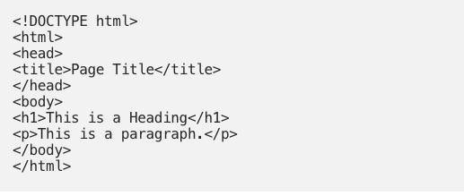
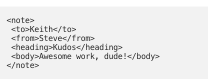

<style type="text/css">
body, td {
   font-size: 14px;
}
code.r{
  font-size: 14px;
}
pre {
  font-size: 4px;
}
</style>


## Orientation for this component

First half


1. Basic programming
2. Data management/creation

--

Then

1. Some machine learning
2. Special focus on causal inference


--

Now

1. Getting data from the web (basics)
2. Getting data from the web (more tips)
3. Getting data from APIs

--

Finally

1. Making html documents
2. R Shiny


---
## How does the Internet work?: Markup

- Let's jump over to politicaldatascience.com to find out

--

- html 



---





- Note that these tags can be more flexible and made up
- Not always consistent across websites, but often consistent across pages on the same website.


---

## How does the Internet work?: Structure

A second fact is that websites aren't usually written by people, but by algorithms.

- Urls are often relatively easy to navigate.

https://www.cnn.com/election/2018/results/nevada/senate
https://www.cnn.com/election/2018/results/tennessee/senate
https://www.cnn.com/election/2018/results/tennessee/house

---

- The website does not exist, but is often constructed:

https://news.google.com/search?q=wisconsin+elections&hl=en-US&gl=US&ceid=US:en
https://www.facebook.com/DonaldTrump/
https://www.facebook.com/pg/DonaldTrump/posts/

---

So if we:

- Know the basic structure of the html content of a page ...
- and unerstand how the urls are set up to navigate ...
- we can pretty easily write a script to tear down large parts of a website.

---
## The devil is in the details

- This can be shockingly easy for the simplest websites.
- And if you have a pre-defined set of urls (or urls implied by specific search combinations) can be pretty easy.
- The hard parts are (or .. begin with):
    1. sometimes actually extracting out the data you want is not straightforward.
    2. sometimes the information you need to construct the urls has to itself be extracted
    3. sometimes what you want is burried not in the html but in javascript (or something else)
    4. sometimes they only want you (or allow you) to pull data from their API.


---
## A task for today

- For today, we are just going to get you as far as building code to scrape a limited number of pages for the data you want.

- Then we'll move onto parsing backend databases (and maybe a little on free-formed crawling) 

- Then onto APIs

--

- But first you need some tools:
    - You will want to install Google Chrome
    - And you will want to install the "Inspector Gadget" Chrome extension I linked to in the slack thread for this class.


---
## Do, Re, Mi...

https://ballotpedia.org/United_States_Senate_elections_in_Arkansas,_2014

- We are going to look at the page.
- And practice using our using our Chrome tools.


---


## let's get started

```{r, eval=TRUE, message=FALSE, warning=FALSE, fig.width=8, fig.height=7}
library(tidyverse)
library(rvest)
arkansas_url<-"https://ballotpedia.org/United_States_Senate_elections_in_Arkansas,_2014"
arkansas_page<-read_html(arkansas_url)
```

- Take a moment to run that and look at object
- You can try to run `html_structure(arkansas_page)` on that

---

Let's start by looking at how to pull out the main text.

```{r, eval=TRUE, message=FALSE, warning=FALSE, fig.width=8, fig.height=7}
mainText<-arkansas_page %>%
  html_nodes('p') %>%
  html_text()
mainText[83:91]
```

---

Now maybe just that top table?

```{r, eval=TRUE, message=FALSE, warning=FALSE, fig.width=8, fig.height=7}
table1<-arkansas_page %>%
  html_nodes('center table') %>%
  html_table(header=TRUE)
table1[[1]][,2:5]
```


---

Another version of that

```{r, eval=TRUE, message=FALSE, warning=FALSE, fig.width=8, fig.height=7}
table1<-arkansas_page %>%
  html_nodes('table.collapsible') %>%
  html_table(fill=TRUE)
table1[[1]][,2:5]
```

---

Let's look at that smaller table

--

```{r, eval=TRUE, message=FALSE, warning=FALSE, fig.width=8, fig.height=7}
table2<-arkansas_page %>%
  html_nodes('table.wikitable') %>%
  html_table()
table2
```

---

Same thing but with inspector gadget

--

```{r, eval=TRUE, message=FALSE, warning=FALSE, fig.width=8, fig.height=7}  
table2<-arkansas_page %>%
  html_nodes('.wikitable center , .wikitable th') %>%
  html_text()
table2
```

---

Can we get that primary date?

--
  
```{r, eval=TRUE, message=FALSE, warning=FALSE, fig.width=8, fig.height=7}  
primaryDate<-arkansas_page %>% 
  html_nodes('td:nth-child(2) center') %>%
  html_text()
primaryDate
```

---

Let's just get the cooks rating 

--
  
```{r, eval=TRUE, message=FALSE, warning=FALSE, fig.width=8, fig.height=7}  
cooksScore<-arkansas_page %>%
  html_nodes('br~ b') %>%
  html_text()
cooksScore
```

---

Can also extact other elements like links

--

```{r, eval=TRUE, message=FALSE, warning=FALSE, fig.width=8, fig.height=7}  
stateLinks<-arkansas_page %>%
  html_nodes('small center a') %>%
  html_attr('href')
stateLinks
```

---
## Over to you

- Go to politicaldatascience.com
- See if you can make an object that gets all of the text under "Lectures"
- See if you can go one step further and get all of of the hyperlinks as well.
- Don't expect this to come easy.  Ask questions or put up bugs on Slack.

---
## End Part A


---
## Functionalizing and extending

- So now you have some (vague) notion of how to parse HTML.

- But webscraping really becomes powerful when you can rip through a lot of pages (or crawl through interconnected pages).

- To do this, you will need to bring to bear a lot of the other skills you have learned:
    - Functionalizing
    - Data management
    - Text parsing
  
---
## Results for the 2014 Election

- We already collected a complete set of links above in the `stateLinks` object
- Can we scrape the results out of all of them?
- We are going to need to:
    - Write a function that takes in url and then extracts the information we need.
    - Loop that function across what we are looking for
    - Be aware that not all of the pages we are going to will necessarily be constructed the same.  How will we know?

---

```{r, eval=TRUE, message=FALSE, warning=FALSE, fig.width=8, fig.height=7}
stateLinks[3]<-"/United_States_Senate_elections_in_Arkansas,_2014"
x<-stateLinks[3]
thisUrl<-paste0("https://ballotpedia.org", x)
thisUrl
this_page<-read_html(thisUrl)
```

---


```{r, eval=TRUE, message=FALSE, warning=FALSE, fig.width=8, fig.height=7}
stateLinks[3]<-"/United_States_Senate_elections_in_Arkansas,_2014"
x<-stateLinks[3]
thisUrl<-paste0("https://ballotpedia.org", x)
thisUrl
this_page<-read_html(thisUrl)
```

---

```{r, eval=TRUE, message=FALSE, warning=FALSE, fig.width=8, fig.height=7}
table1<-this_page %>%
  html_nodes('center table') %>%
  html_table(header=TRUE)
str(table1)
```


---

Let's just make that a function

```{r, eval=TRUE, message=FALSE, warning=FALSE, fig.width=8, fig.height=7}
scrapeResults<-function(x, stateLinks){
  thisUrl<-paste0("https://ballotpedia.org", stateLinks[x])
  table.out<-read_html(thisUrl) %>%
    html_nodes('center table') %>%
    html_table(header=TRUE)
  table.out
}
results1<-scrapeResults(3, stateLinks=stateLinks)
str(results1)
```


---
## Over to you

- Now use the code I gave you above, and scrape out all of the "main text" of each of these posts.  

```{r, eval=TRUE, message=FALSE, warning=FALSE, fig.width=8, fig.height=7}
mainText<-arkansas_page %>%
  html_nodes('p') %>%
  html_text()
```

- Write a function (or a piped script) that allows you to scrape all of of these election pages.
- It should be organized as a list so that each element of the list corresponds with one page.
- Count the number of times that "fundraising" and "immigration" (and related terms) appear on each page.  Make a summary plot (boxplot, histogram, etc.) and put the results on slack.


---
## End part B


---
## Testing this in a new place.


Will that work all of the time?

```{r, eval=TRUE, message=FALSE, warning=FALSE, fig.width=8, fig.height=7}
scrapeResults(1, stateLinks=stateLinks)
```


Nope!

---

Try a different node identifier?

```{r, eval=TRUE, message=FALSE, warning=FALSE, fig.width=8, fig.height=7}
scrapeResults<-function(x, stateLinks){
  thisUrl<-paste0("https://ballotpedia.org", stateLinks[x])
  table.out<-read_html(thisUrl) %>%
    html_nodes('table.collapsible') %>%
    html_table(fill=TRUE)
  table.out[[1]]
}
results1<-scrapeResults(1, stateLinks=stateLinks)
str(results1)
```

---

```{r, eval=TRUE, message=FALSE, warning=FALSE, fig.width=8, fig.height=7}
results1<-scrapeResults(1, stateLinks=stateLinks)
str(results1)
```

---

So that's good?  Let's try that for all of them.

```{r, eval=TRUE, message=FALSE, warning=FALSE, fig.width=8, fig.height=7}
library(plyr)
allResults<-llply(1:length(stateLinks), scrapeResults, stateLinks=stateLinks)
names(allResults)<-stateLinks
```

---

- Still not perfect but a lot of the way there
- Would need to figure out how to strip out and organize all of these together into a useful data frame.

---

## Before I turn it over to you ....

- Some of these lines of code above took me an hour to get right.
- You just have to poke around.
- Look for examples and tutorials and stackoverflow threads
- Ask questions on slack.  You are not dumb. This can be very tricky.


---
## Who studies political parties?

So let's go look at this:

https://scholar.google.com/scholar?hl=en&as_sdt=7%2C26&q=political+parties&btnG=


---

```{r, eval=TRUE, message=FALSE, warning=FALSE, fig.width=8, fig.height=7}
gs_url<-"https://scholar.google.com/scholar?hl=en&as_sdt=7%2C26&q=political+parties&btnG="
pg1<-gs_url%>%
  read_html()%>%
  html_nodes(".gs_ri a , .gs_a , .gs_rt") %>%
  html_text()
```

---

## Group project

1. Build a dataset of articles/books/authors under this tag.
2. Record the number of citations for each entry.
3. Give me a boxplot of the *logged* number of citations.
4. Go through multiple pages.  You might be stopped.


