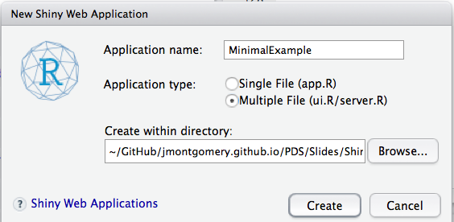

<style type="text/css">
body, td {
   font-size: 14px;
}
code.r{
  font-size: 14px;
}
pre {
  font-size: 4px;
}
</style>


## Orientation for this component

Last time

1. Making html documents/website (Dom)


--

Now


1. Creating interactive apps using Shiny

--

Next


**Work on your group projects**


---
## Orientation


- What is shiny and a bit of how it relates to "apps" in general
- How a Shiny App is constructed
- A few (of many, many) bells and whistles
- How to integrate an App into a document


---


1. We are going to have a directory on your computer that holds your files.
2. You are going to make two files: user interface (UI) and server
3. The UI is the part that the user tinkers around with and what they see.
    - If there are user-defined inputs, then they are set here.
    - If there are outputs, they are primarily displayed here.
    - The outputs are often "dynamic"
    - But this function controls little other than what is passed to the server and what is shown on the page.
4. The server is where all of the calculations are done or plots are made or texts are combined.
    - It will take inputs from the UI.
    - And it will pass back outputs to the UI too.
5.  We will talk about them separately, but remember they are in constant dialogue.


---

## Example 1

```{r, eval=FALSE, message=FALSE, warning=FALSE, echo=TRUE}
library(shiny)
runExample("01_hello") # a histogram
```

- Let's run this and look through the code
- Then we'll make a slightly different version


---

## More examples just to get a taste

```{r, eval=FALSE, message=FALSE, warning=FALSE, echo=TRUE}
runExample("02_text") # tables and data frames
runExample("03_reactivity") # a reactive expression
runExample("04_mpg") # global variables
runExample("05_sliders") # slider bars
runExample("06_tabsets") # tabbed panels
runExample("07_widgets") # help text and submit buttons
runExample("08_html") # Shiny app built from HTML
runExample("09_upload") # file upload wizard
runExample("10_download") # file download wizard
```


---

## End Part A

Go find **two** super cool/fun Shiny Apps and post a link up to Slack.  At least one should not be from the RStudio gallery.

----


Files for next few examples available at: 

http://politicaldatascience.com/PDS/Slides/ShinyApps.zip


---

## A minimal example


- Go to R studio and select `File` --> `New File` --> `Shiny Webb App`

- Select the "Multiple File" option and select where you want it to be stored.





- You should now have a folder called "MinimalExample" with two files: `server.R` and `ui.R`


---
## Some notes


- This is the geyser example from above.

- When you open either file, you can select the "Run App" button above to see what it looks like.

--

- You always need to have a  `library(shiny)` call at the top of these files.

- The ui file needs a call to `shinyUI`

- The server file needs a call to `shinyServer`

- There is a little bit of R here, but a little bit of html (e.g., `h3()`)

---

## Minimial exampl UI

```{r, eval=FALSE, message=FALSE, warning=FALSE, echo=TRUE}
library(shiny)  ## Load shiny
shinyUI(fluidPage( ## Flexible layout function 
  titlePanel("Minimial App"), ## Setting the title
  sidebarLayout( ## Choosing layout with inputs on side and 
                 ## outputs displayed in the main body
    sidebarPanel( #Things in this function specify the sidebar
       textInput(inputId = "comment", 
                   label = "What you want?",
                   value=""
    )), ## End of sidebar
    mainPanel( ## Arguments for main section (output)
      h3("This is what you said"), # A subtitle
                                 # Notice the comma
      textOutput("textDisplay")
    ) # Close main panel
  ) #
))
```


---
## An example server


```{r, eval=FALSE, message=FALSE, warning=FALSE, echo=TRUE}
library(shiny) # call to shiny
shinyServer(function(input, output) { ## Funciton defenition
## server behavior is defined in here
## In this case, we are going to add a component to 
## the output.
  output$textDisplay <- renderText({ # We need to creat the text here
    # Note that `textDisplay` is the same as in the UI
    # where it is included in the textoutput() call
    paste0("You said '", input$comment, # the ID specified in the UI
           ".' There are ", nchar(input$comment), 
           " characters in this."
           ) #close paste0
  }) #Close renderText 
}) # Close function/shinyServer call
```

---

## Note: Other kinds of inputs

```{r, eval=FALSE, message=FALSE, warning=FALSE, echo=TRUE}
runGist(6571951)
```

---

### End of Part B

- Set up this minimal App on your own machine
- Try and change at least two things.  Maybe break it and then fix it again?


---
## Let's make our own App

I want to make an app that:

1. For any Senate race, plots the polling over time

2. I can add or take out a smoothed trend.

3. I can switch between a few specific states.

---

- We'll start slow and simple and just do one state.

- But even here we'll have to introduce a few additional concepts including:
    * Reactive data
    * renderPlot()

---

## Let's look at a plot that we might want to make

```{r, eval=TRUE, message=FALSE, warning=FALSE, echo=TRUE}
library(dplyr); library(ggplot2)
setwd("~/GitHub/jmontgomery.github.io/PDS/Datasets/SenateForecast")
senateData<-read.csv("PollingCandidateData92-16.csv")

stateName<-"North Carolina"

stateData<-senateData %>%
  filter(state==stateName & cycle==2016) %>%
  select(c("Poll", "daysLeft", "Candidateidentifier")) %>% 
  group_by(Candidateidentifier)%>%
  glimpse()
```

---

```{r, eval=TRUE, message=FALSE, warning=FALSE, echo=TRUE,  fig.width=9, fig.height=5.5}
thisPlot<-ggplot(stateData, 
       mapping=aes(x=daysLeft, y=Poll, color=Candidateidentifier)) +
  geom_point()  + 
  geom_smooth() +
  ggtitle(paste0("2016 Senate Election in ", stateName)) + 
  labs(y="Poll results", x="Days Till Election")
print(thisPlot)
```

---

### Overall plan

- So we want to make an app that let's people choose the state to plot.
- And will allow them to include or not include the points.
- We are going to have to edit the `ui` and `server` file together to get this to work out.


---

### Start with the UI

```{r, eval=FALSE, message=FALSE, warning=FALSE, echo=TRUE, fig.width=9, fig.height=5.5}
library(shiny)
shinyUI(fluidPage(  
  titlePanel("2016 Senate Polling"), ## Setting the title
  sidebarLayout( 
    sidebarPanel(
       selectInput(inputId = "stateSelect", # Different input
                   label = "Choose state to display",
                   choices=c("MO"="Missouri",
                             "FL"="Florida",
                             "NC"="North Carolina",
                             "IA"="Iowa"
                   ),
                   multiple=FALSE
    )), ## End of sidebar
    mainPanel(  ## putting the main output here
      plotOutput("trendPlot")
    ) # Close main panel
  ) 
))
```


---

## On to the server


```{r, eval=FALSE, message=FALSE, warning=FALSE, echo=TRUE, fig.width=9, fig.height=5.5}

############################################################
################## Server for Senate Polls #################
############################################################
library(shiny)
shinyServer(function(input, output) {
  
  ## This will just be executed once
  senateData<-read.csv("PollingCandidateData92-16.csv") 
  
  # This will be updated when options are changed.
  passData<-reactive({ 
    stateData<-senateData %>%
      filter(state==input$stateSelect & cycle==2016) %>%
      select(c("Poll", "daysLeft", "Candidateidentifier")) %>% 
      group_by(Candidateidentifier)
    return(stateData)
  })

    # Now we prepare the output
  output$trendPlot <-renderPlot({ # Note the brace
    thePlot<-ggplot(passData(),  # Note passData() is a function
           mapping=aes(x=daysLeft, y=Poll, color=Candidateidentifier)) +
      geom_smooth() +
      ggtitle(paste0("2016 Senate Election in ", input$stateSelect)) + 
      labs(y="Poll results", x="Days Till Election") + 
      geom_point() 
    print(thePlot)
  })
  
  
  }) # Close function/shinyServer call
```


---

## Maybe let's add another option


```{r, eval=FALSE, message=FALSE, warning=FALSE, echo=TRUE, fig.width=9, fig.height=5.5}
library(shiny)
shinyUI(fluidPage(  
  titlePanel("2016 Senate Polling"), ## Setting the title
  sidebarLayout( 
    sidebarPanel(
      selectInput(inputId = "stateSelect", # Different input
                  label = "Choose state to display",
                  choices=c("MO"="Missouri",
                            "FL"="Florida",
                            "NC"="North Carolina",
                            "IA"="Iowa"
                  ),
                  multiple=FALSE
      ), # End of selectInput
      checkboxInput(inputId = "points", label="Add points?", 
                    value = FALSE)
    ), ## End of sidebar
    mainPanel(  ## putting the main output here
      plotOutput("trendPlot")
    ) # Close main panel
  ) 
))

```

---

```{r, eval=FALSE, message=FALSE, warning=FALSE, echo=TRUE, fig.width=9, fig.height=5.5}
library(shiny)
shinyServer(function(input, output) {
  
  ## This will just be executed once
  senateData<-read.csv("PollingCandidateData92-16.csv") 
  
  # This will be updated when options are changed.
  passData<-reactive({ 
    stateData<-senateData %>%
      filter(state==input$stateSelect & cycle==2016) %>%
      select(c("Poll", "daysLeft", "Candidateidentifier")) %>% 
      group_by(Candidateidentifier)
    return(stateData)
  })
  
  # Now we prepare the output
  output$trendPlot <-renderPlot({ # note brace
    thePlot<- ggplot(passData(),  # Note passData() is a function
           mapping=aes(x=daysLeft, y=Poll, color=Candidateidentifier)) +
      geom_smooth() +
      ggtitle(paste0("2016 Senate Election in ", input$stateSelect)) + 
      labs(y="Poll results", x="Days Till Election")
    if(input$points){
     thePlot<-thePlot+ geom_point() 
    }
    print(thePlot) 
  })
  
  
  }) # Close function/shinyServer call
```


---

### Final notes

1. Can be extended in a variety of ways to make more complex.
2. Can be a nice way to provide a "dashboard" to data with more control over any internal data analytics (and borrowing the full flexibility of R).
3. Easy to publish or host on github.


