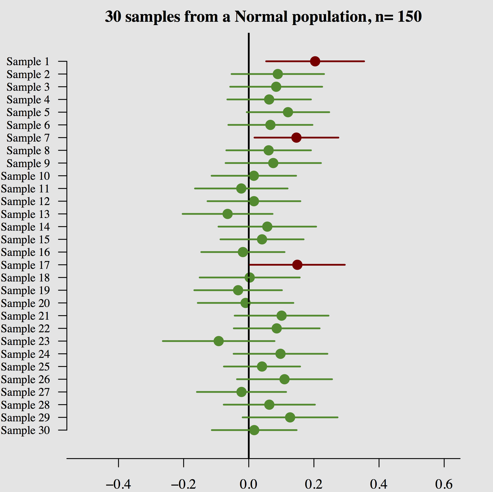

# Confidence intervals in R 

## Learning Goals 

- Plotting the t distribution, with different degrees of freedom

- Building confidence intervals (CIs) 

## Example Graphs and R Code: 

```{r}
par(mfrow=c(1,3))
x.numbers <- seq(from=-6.869, to=6.869, length.out=100)
plot(x=x.numbers, y=dt(x.numbers, df=2), xlab="x", ylab="Density",
     main=paste("t Distribution:  DOF=2"),
     type="l",col="green",ylim=c(0,0.5))
plot(x=x.numbers, y=dt(x.numbers,df=10), xlab="x", ylab="Density",
     main=paste("t Distribution:  DOF=10"),
     type="l",col="red",ylim=c(0,0.5))
plot(x=x.numbers, y=dt(x.numbers,df=30), xlab="x", ylab="Density",
     main=paste("t Distribution:  DOF=30"),
     type="l",col="blue",ylim=c(0,0.5))
```

## What is a Confidence Interval? 

- Interval estimate of a population parameter

- Takes into account the uncertainty

- Depends on the data and confidence level

- Confidence level: If confidence intervals are constructed across manyseparate data analyses, the proportion of such intervals that contain the true value of the parameter will match the confidence level. For exampl, if we had a 90\% confidence interval, we would expect 90\% of confidence intervals we construct to include the true parameter $\mu$.


<center>

**Example **

```{r, echo=F, out.width = "400px"}

```
</center>

This is is 30 samples (n=150) from a normal population ($\mu=0$) and the resulting 90% confidence interval. 

Out of the 30 confidence intervals, only 27 of them (90%) include $\mu$!


- What happens when we increase/decrease confidence level? The confidence intervals will get wider and more of them will include $\mu$.


##Confidence Intervals for the Mean of Populations 

- Obtain $\bar{y}=\frac{\sum{y_i}}{n}$

- Obtain $\sigma_{\bar{y}}=\frac{\sigma}{\sqrt{n}}$ or $\hat{\sigma}_{\bar{y}}=\frac{S}{\sqrt{n}}$

- Choose a confidence level
 
- Obtain confidence coefficient: $\frac{\text{confidence level}}{100}$

- Find the Z-score that corresponds to $\frac{(\text{1-confidence coefficient})}{2}$ [Normal Table or R]


Confidence Interval for your chosen confidence level: 

($\bar{y}-z*\sigma_{\bar{y}},\bar{y}+z*\sigma_{\bar{y}}$)

## In R: 

###Numerical Summaries: 

- Get the mean, standard deviation and number of observations of thevariable you are interested in

###Normal Quantiles

- The <code>qnorm()</code> gives you the required z-score.


### Code 

Obtain the Z- score and save it in an object called z.score: 

```{r, eval=F} 
z.score = qnorm(1-confidence coefficient/2)
```

For example, for a 99\% confidence interval, I could use 
```{r, eval=T} 
z.score = qnorm((1-.01/2))
z.score
```


Get mean, sd, and n of the variable and save in appropriately named objects:

```{r, eval=F}
mean.variable = mean(nameofdataset$nameofvariable,na.rm=T)
sd.variable = sd(nameofdataset$nameofvariable,na.rm=T)
n = length(na.omit(nameofdataset$nameofvariable))
```

Remember that R stores missing data as <code>NA</code>. So the <code>na.omit()</code> removes missing data from the vector. And the <code>na.rm=T</code> tells R to ignore missing data when calculating the standard deviation or the mean.

Compute lower bound: 

```{r, eval=F}
mean.variable - z.score*sd.variable/sqrt(n)
```

Compute upper bound:

```{r, eval=F}
mean.variable+ z.score*sd.variable/sqrt(n)
```

