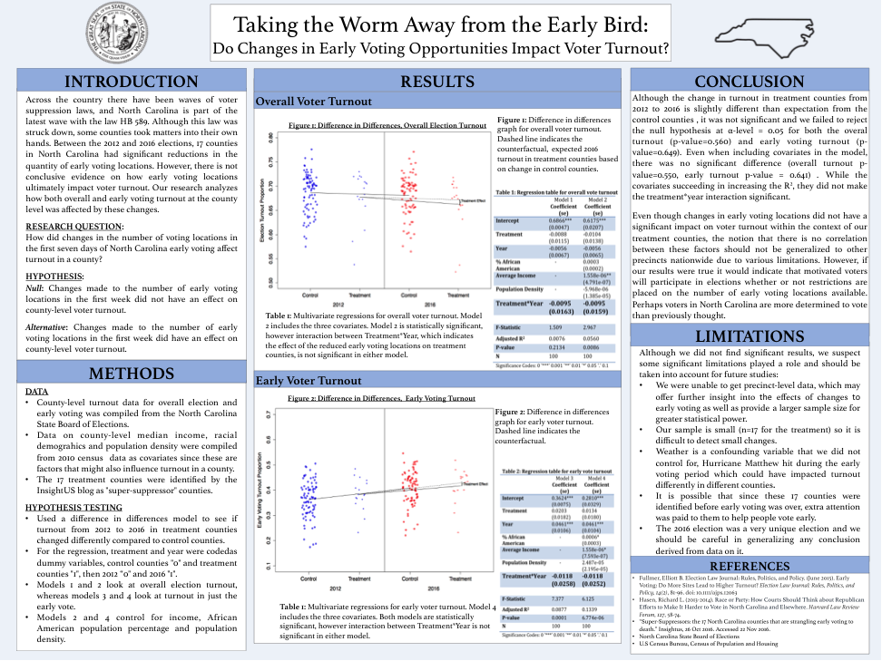
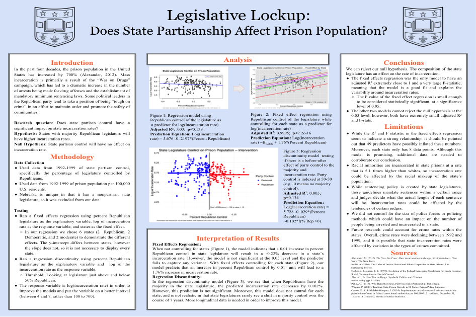

# Poster Projects

As we get closer to starting group research projects, I wanted to give you a run-through of my expectations. I’ve put together an overview of what is expected of your group. 

But if you have any questions, **please** don’t hesitate to reach out to me. The TAs are a good resource for specific question, help with R, etc.  But I grade these posters personally and consider them the most important part of the course. So I should be your first and last point of contact for "big" questions like topic, research design, etc.

## Grading

Your project’s grading will be based on a very specific rubric listed on the syllabus. 

You will be graded on eight different parts of your project:

1. Introduction and Theory
2. Methods
3. Results
4. Limitations and Conclusions
5. Statistical Analysis (poster)
6. Statistical analysis (R Script)
7. Visual Design
8. Writing Quality

Each section is graded on a 5 points (for a total of 40 points). The necessary requirements to get all five points per section are extensively explained on the rubric. I suggest that you spend time looking over it in order to familiarize yourself with my expectations.  

## Finding the right topic, question, theory, and data

### Topic

You should have a strong and substantive motivation for why you chose the research question you did. This section should include a few sentences of background. Why did you choose this question? Why is it important? What is it that your research attempts to answer?

To be perfectly clear **you are allowed to study any topic you want**. But that does not mean that all topics and questions are equal. Be prepared to tell me why your topic is interesting.

### Question

This section should also specify your research question. Your research question should be succinct, easily understood. 

Most importantly, your question should be something you care about.  What topics interest you? What phenomenon are you dying to explain? Consider questions like these in order to formulate your research. If you don’t care about the question itself, then the project will be miserable to complete. 

### Theory

What you expected when you started gathering data (your theory of how the world works), and why. You don't have to write much, but you should clearly state *why* your expectations were what they were.

### Out of bounds

Though you are given a lot of room explore, you’re not allowed to do any of the following projects:

- No "Time Series" studies where we are studying one unit over time. Questions like, "what drives presidential approval?" are out of bounds because time-series requires additional statistical skills not covered in this course.
- No exploratory projects
    - ex. What factors determine attitudes toward abortion? 
    - You need to tell me what factors drive attitudes towards abortion and then test that theory.
- No sensitive data/risky behaviors/at-risk populations
    - ex. Surveys of dating habits, drug use, alcohol consumption, etc.
    - Surveys of minors, the homeless, etc.
- Do **NOT** sample on the dependent variable 
    - ex. Study the causes of election fraud using a sample of fraudulent elections. We also need to know about cases where there was *not* a fraudulent election to answer this question.
    - ex. Study the causes of police shootings using a database of instances where there is a police shooting.  We also need to know about cases where there was *not* a police shooting to answer this question.
- Do **NOT** sample on the independent variable 
    - ex. Studying the effect of church attendance on political beliefs by surveying people at church. 
    - To know the effect of church attendance we also have to know about the behaviors of non church goers.

### Hypothesis

Your hypothesis needs to be falsifiable.  Don’t ask broad questions such as: Why do Americans Vote? What causes peace? Geting more specific allows you to state a hypothesis that you could reasonably test with data. "What makes college kids vote?" is bad.  "College students don't vote when there are stricter registration laws in their state," is good.   

If you need examples, please see the sample poster presentations below for ideas of what your hypothesis should look like. But they need to be clear.  And you need to be able to tell me what kind of statistical evidence would prove you **wrong**.  Because if you cannot explain that, then you don't really have a scientific theory (or a null hypothesis for that matter).  

### Data Collection

You have the option of using pre-collected data or collecting it on your own (which is encouraged, but not required). 

- The university pays for all students to have access to Qualtrics, a powerful survey software that is at your disposal. 
- Should you choose to collect your own, please see me before executing your data-collecting plan. I may be able to provide you with "incentives" (e.g., a drawing for a gift card).

If you don’t plan on collecting your own, here are a few resources I recommend for data:

- [Harvard’s Institute for Quantitative Social Sciences](https://dataverse.harvard.edu/) 
- [American National Election Study (ANES)](http://www.electionstudies.org/)
- [The ICPSR data set archives](https://www.icpsr.umich.edu/icpsrweb/instructors/icsc/datasets.jsp)

The Political Science Subject Librarian can also be a good resource for finding data:

- Cynthia Hudson-Vitale 
- chudson@wustl.edu
- $314.935.7465$

And if only you knew a faculty member with wide ranging interests in quantitative analysis who is experienced in helping undergraduates get the data they need to do a good project, maybe you could go ask her/him for some help.

## Actually making a poster (writing and visual design)

**Remember**: This is a poster NOT a paper. Your project should use clear and concise writing and full sentences WITHOUT cramming paragraph on paragraph worth of information on your poster. In fact, I would be happy with no paragraphs. You should be able to succinctly explain each step of your research without having to write a page on it. The fewer words the better. The number one way that students lose points on the poster is that I view them as "wordy."

Most groups will choose to create their poster using Microsoft PowerPoint but there are, of course, other ways.  The layout should flow easily and be aesthetically pleasing.  Please don’t make a poster that is unreasonably colored or has weird fonts.  This is unnecessary and will distract from the substantive material on the poster. I should not have any issues attempting to read your findings.  

Finally, you will be responsible for actually *printing* a copy of the poster and bringing it to the last lab period.  Don't put it off to the last minute.

## R Code

The code you use for your analysis should be submitted to me in the form of an R Script. The only thing I should need to change in the script you submit to me is the working directory.  Otherwise, **I should be able to run your entire analysis without any error readings and it will replicate the results on your poster exactly**. Thus, I will also need all of the data.

*Any* errors, or discrepancies will result in a subtraction from your score on this section of the rubric.  

Additionally, your code should have informative comments throughout (using the # in your script) to explain what you’re doing. Code without comments will be penalized.

In general I do not need to see all of the code you used to collect/organize/clean your data.  But I do want the code that takes your final dataset and conducts the statistical analyses and generates the figures.

## Methods

First, your methods section should include an explanation for how you collected your data and the methods with which you used to analyze it. Did you collect the data yourself? If so, how did you do it? If you used a survey, what questions did you ask? 

If you did not collect it yourself, please explain where you got your data from (a State Board of Elections, Harvard’s Dataverse, Census, etc.) and give a brief account of its methedology.  This goes for data you used for covariates as well, should you choose to include some.  

Second, explain how you tested your hypothesis. It should include all important aspects of how your study was conducted in a detailed and replicable fashion.  What method you used (Difference in Differences, Instrumental Variables, a Fixed Effects model, etc.), if you used a dummy variable, or any other aspect that is vital to understanding your study design.  

Overall, your methods section should include all important aspects of how the study was conducted that convincingly motivates and defends the key choices in your design process.  

## Results 
Your results section should include a combination of figures and tables that illustrate your findings in an intuitive and easy-to-understand format.  It should be clear exactly what you found.  Any figures you use should be created in R. Excel figures make me angry. Tables may be created using Microsoft Office.  

Because a majority of this section will be dedicated to your graphics, don’t worry about including a long, written analysis for your results section.  Let your graphics and tables tell the story of your analysis with short comments that explain what they are showing.  Look to past poster examples for an idea of what I’m looking for. 

##Conclusion and Limitations

### Conclusion

Use this section to discuss potential explanations for your findings.  What did you find? Was it statistically significant? What does this tell you about the question your project attempts to answer? What inferences can we draw from what you found? What are some ideas for future research? Your conclusion should include whether or not you were able to reject your null hypothesis.  

Please keep in mind, it is not required that you find statistically significant results that will allow you to reject your null hypothesis.   More than likely, not a lot of groups will be able to. This is ok! You can still create a well-designed project and make substantive recommendations for future research. 

Remember, you are new at this.  If you are really testing a new/interesting idea, the odds are pretty good that you are going to be wrong and the data won't back up your hypothesis.  But that's how this is all *supposed* to work.

I greatly prefer teams who go out on a limb in persuit of exciting knowledge and fail to teams that play it safe.

### Limitations

Every single one of your research projects will have limitations. This section should be a detailed discussion of those that you faced through every step of the process. What problems did you face that would affect your results? Were there possible confounding variables you were unable to control for? What were the limits of your study design? Or in the data collection? These are all things you should consider when formulating this section for your poster.

## Technical stuff

### Submitting Your Projects:

All projects must be submitted to me by email before class on Wednesday, December 4th.  You do not need your printed poster for class that day, but you will need it ready by the beginning of your lab session as you will present to me, your ATI and your peers in your section. 

- Be sure to include the title of your poster in the subject line of the email and your group number and the names of all members of the team in the main text.
- Your emailed file should be zip file that includes
    - your data,
    - a **PDF** of your poster,
    - and an R script of your analysis. 

### Printing

Yes, you have to print out your poster. There are multiple places on campus and off that have the capability of printing out a poster like this. It is up to you to fund and print your poster before presenting to your lab. We will not do this for you.  That being said, we will provide some possible printing options and resources closer to the project due date.

## Tips for Doing Well 

1. Start Early

This is true for all group projects, but starting early will ensure that you have enough time to work out any kinks or issues you have with your projects before its due.  Groups that start their project after Thanksgiving Break don’t do as well as groups that get started closer to the beginning of November.  Please remember that this project is worth 25% of your grade and should not be taken lightly. My expectations for these projects go up every year, therefore my threshold for an A level poster goes up as well.  

2. Office Hours: Come Early, Come Often

While you are only required to come speak with me once about your projects, I encourage you to check in with me more than this.  I grade the projects and therefore only I know what I’m looking for. The teams that meet with me early and often are the ones that always do well. 

3. Pay Close Attention to the Rubric 

Please take a close look at what the markers are for getting high marks in each grading section.  I will follow these requirements for 5’s very closely. 

## Past Poster Project Examples 

Below I am providing posters that did very well in past years.  That being said, the posters were not perfect. So while all of these were great projects, I'll point out a few strengths and weaknesses so you can do even better.

 
 

[PDF version here.](HiResPoster1.pdf)

 
Strengths:

- Strong motivations for their research and hypothesis 
- Collected their own data! 
- Two different datasets!
- Exhaustive limitations and conclusion sections that includes substantive interpretation of their results 

Weaknesses: 

- This project is way too wordy. The design should include fewer descriptions and rely more on their graphs and tables to speak for themselves
- While the results themselves are well done, the organization and structure makes it hard to follow.   
- Should include prospects for future research
 
 
 
 
[PDF version here.](HiResPoster2.pdf)

Strengths: 

- Well thought out and interesting research design with substantive motivation
- Collected their own data!
- Great description of their data collection methods that encompasses all relative information pertaining to their methodology.
- Shows a thorough understanding of their results section
- Still too wordy.

Weaknesses:

- Methods section does not discuss how they tested their data. 
- Results section, while it has a lot of description, the figures themselves are hard to interpret. Please make sure that your graphs are easily understood.
- The limitation and conclusion section should be expanded on. 

 
 
[PDF version here.](HiResPoster3.pdf)

Strengths:

- Substantive reasons for research and clear hypothesis
- Methods section describes both data-collection techniques and hypothesis testing techniques 
- Limitations and conclusions sections are substantive and perceptive 
- Results section allows graphics to speak for themselves and it is easy to understand their findings without paragraphs of information needed

Weaknesses:

- Should include more specific grounds for future research
- Some small spelling and grammatical errors 
- Somewhat wordy in parts.

 
 

[PDF version here.](HiResPoster4.pdf)

Strengths:

- Well considered research question and hypothesis testing
- Methods section is specifies all important aspects of how the study was conducted.
- Appproaches a difficult inferential problem from two different approaches, one of which required gathering their own data.
- Perceptive and detailed discussion of their limitations and conclusion including possible future research. 
- Attractive design that makes their research easy to interpret 
- Consise wording that conveys information directly.

Weaknesses:

- Makes me worry that I may be out of a job.

