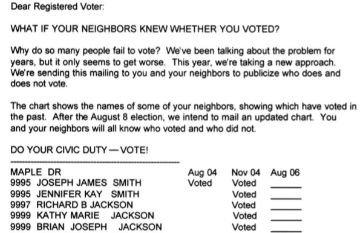

# T-tests in R 

In order to do hypotheses tests for difference in means, we are going to need to

- Learn how to recode factors
- Learn how to do hypothesis testing for the difference of means in R


## Gerber, Green, & Larimer GOTV Data 


We are going to discuss the social pressure experiment I showed in the lecture on causality.  In 2006, one of three mailers was sent out as part of a study:

- Civic Duty (It's your duty to vote)
- Hawthorne (You're being studied)
- Neighbors (Your neighbors will know if you voted)

First let's read in the data and look at it:
```{r, eval=T}
social <- 
  read.csv("https://raw.githubusercontent.com/kosukeimai/qss/master/CAUSALITY/social.csv")
colnames(social)
```


## Did these mailers affect turnout?


Here is an example of the mailer they sent out?

```{r, echo=F, out.width = "400px"}

``` 

We want to know if these messages had a causal effect on turnout.  Let's take a look at the messages that were sent.

```{r, eval=T}
table(social$messages)
```

Just to make things easier, let's recode this variable so we only a have a control group and an overall treatment group (including all three treatment messages).


```{r, eval=T, warning=FALSE}
### You will need to install this package
## install.packages("car")
library(car)
```

```{r, eval=T}
social$messages2 <- recode(social$messages, 
     " 'Hawthorne'='Treatment'; 'Civic Duty'='Treatment';
      'Neighbors'='Treatment' ")  
table(social$messages2)
```


## Now we can finally run our t-test

Does turnout differ between treatment and control?

Using the <code>t.test()</code> function we can find out.

- We are using the <code>data=social</code> dataset
- Within that dataset, we want <code>primary2006</code> to be the outcome
- Within that datset, we want <code>messages2</code> to be the treatment
- We are using a two-sided test
- <code>var.equal</code> indicates whether we want to assume that the population variance in both samples is identical. In class we always assume they are (to make the math easier, but here we are more agnostic)


```{r, eval=T}
t.test(primary2006 ~ messages2, alternative = "two.sided",
     var.equal = FALSE, data = social)
```

### Understanding the output

The output tells us several things.

- We get a t-statistics of -23.869 
- We have 234,580 degrees of freedom.  
- The p-value is equal to $2.2\times 10^{-16}$, which is a **very** small number. 
- It shows the 95\% confidence interval for the **difference in means**.  
- It provides the mean in the treatment and control groups.


### important options for the  <code>t.test()</code> function

Adjust for our hypothesis, given $H_0$ is $\mu_a = \mu_b$:

- if $H_a:$ $\mu_a \neq \mu_b$, then <code>alternative = "two.sided"</code>
- if $H_a:$ $\mu_a > \mu_b$, then <code>alternative = "greater"</code>
- if $H_a:$ $\mu_a < \mu_b$, then <code>alternative = "less"</code>

Adjust for variance assumptions:

- If we assume unequal variance, then <code>var.eq = F</code>
- If we assume equal variance, then <code>var.eq = T</code>

### Alternative Usage of the <code>t.test()</code> Function 

We can also give t.test two vectors.  First, create objects for turnout for two specific mailers:

```{r, eval=T}
neighbors <- social[social$messages == "Neighbors", "primary2006"]
civic_duty <- social[social$messages == "Civic Duty","primary2006"]
```

Note that at this point we are looking at two of the treatment groups and comparing them (which is not what we did above).  Now we can run our t-test using

```{r, eval=T}
t.test(x =  neighbors, y = civic_duty)
```

## Now a video

Now watch this video

<iframe width="560" height="315" src="https://www.youtube.com/embed/RlhnNbPZC0A" frameborder="0" allowfullscreen></iframe>  
