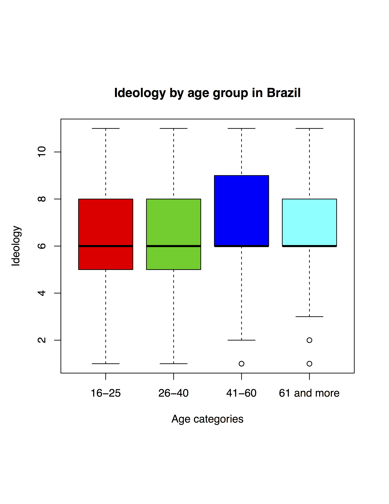
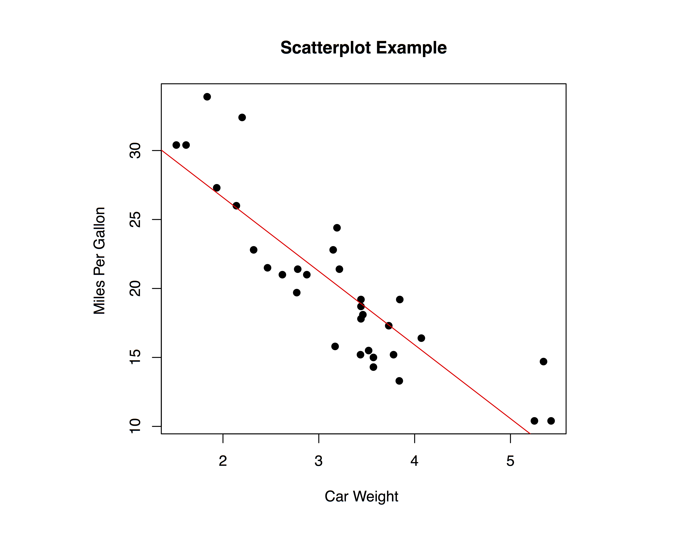

#  Contingency tables and bivariate data

It is very common that a question relies on a discussion of the relationship between two variables. 

What type of variables?

- Age and Vote Intentions

- Party Ideology and Party Desire to Form Coalitions

- Income groups and Spending on Alcohol

## Discrete by Discrete Data Display 

- Assume the two variables of interest are both countably discrete.

- To examine the relationship between these variables, we will use \textbf{contingency tables}.

- A contingency table is used to plot membership by groups.

| | Democrat | Republican | 
|-|-|-|
|Male | 36 | 56 | 
|Female | 43 | 22 | 

- Here we see that women are more likely to be Democrats than men.

## Contingency Tables 

- The same contingency table with row percentages.

- Does it make more sense to percentagize by sex or vote in the previous table?

- General rule: percentagize by the independent/ explanatory variable. Below we do it by gender (i.e. by row).

| | Democrat | Republican | 
|-|-|-|
|Male | 39.1% | 60.9% | 
|Female | 66.1% | 33.9% | 

- Note that the percentages add up to 100 on each row, not over each column. 

## Creating Contingency Tables in R 

Recall: Contingency tables take factors. If it is not a factor, you will need to convert it (see the chapter on average treatment effects.)


Code like this will give you a contingency table:
```{r, eval=F}
# Frequency 
freq.tab <- with(data, table(factor1, factor2))
```

Code like this will give you a contingency table with percentages:
```{r, eval=F}
#Percentage 
with(data, round(prop.table(freq.tab)*100, 2))
```

Code like this will conduct the $\chi^2$ test for independence:
```{r, eval=F}
# Chi-Square 
chisq.test(freq.tab)
```

## Discrete by Continuous Displays 

When we have one discrete variable and one continuous

- Rely on some of the methods that we have used previously! 

Options:

- boxplots for each group;

- histograms for each group;

- plot the distribution of observations for each group.

```{r, echo=F, out.width = "400px"}

```

You can make plots like this using the <code>boxplot()</code> function:
```{r, eval=F} 
boxplot(y~x,data = dataset,
        xlab = "Informative X label",
        ylab = "Informative Y label",
        main = "Informative Title",col = c(col1, col2, ....))
```

## Continuous By Continuous Displays 

If we want to examine the relationship between two continuous variables graphically, we will utilize a scatterplot. 

- Income by Age
- Income by Ideology (21-point scale)
- Note: when ordered categories are plenty enough, consider them as continuous

```{r, echo=F, out.width = "400px"}

```

```{r, eval=F} 
plot(x, y, data = dataset, 
     main = "Informative Title",
     xlab = "Informative X label",
     ylab = "Informative Y label",
     pch = 19)      
```

## The value of Scatterplots

Scatterplots allow us to assess the direction and strength of a relationship between 2 variables.

3 types of relationships:

- **Positive:** As x increases, y also increases.

- **Negative**: As x increases, y decreases.

- **No Relationship:** There is no relationship between the variables.


### In  R, we can only make scatterplots with **numeric** variables!

- Check whether the variable is numeric using code like this:

```{r, eval=F}
str(datasetname$variableofinterest)
is.numeric(datasetname$variableofinterest)
```

- If your variable is not numeric in structure but convertible to be numeric, such as numbers as factor levels or numbers as characters within quotation marks, we can convert it to a numeric variable (only if it makes sense):

```{r, eval=F} 
datasetname$newvariable <- as.numeric(datasetname$variableofinterest)
```
