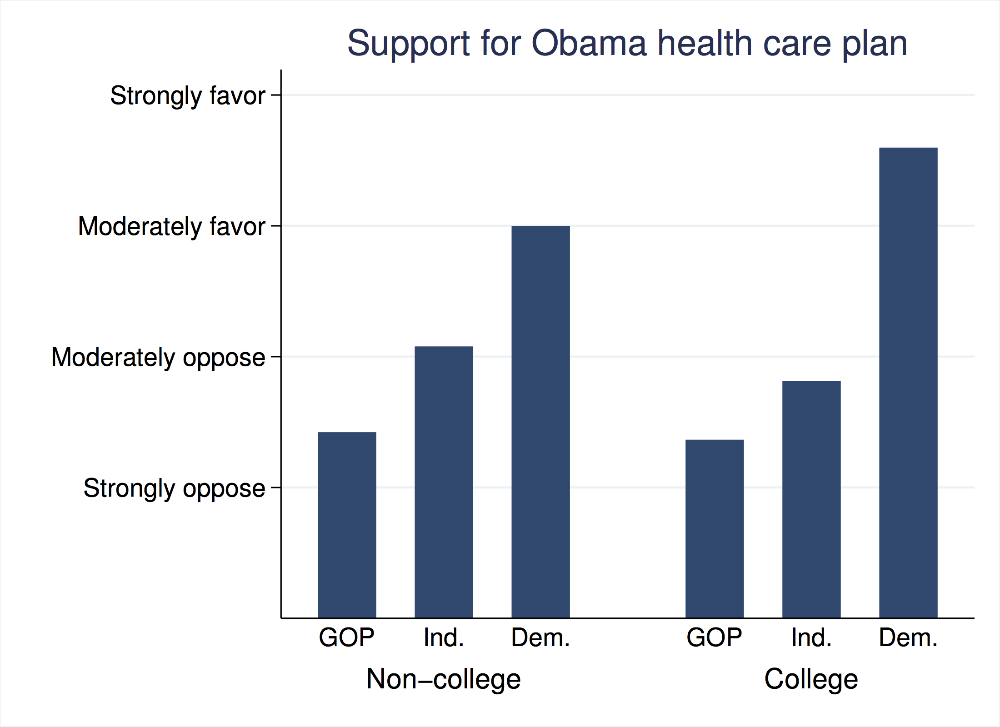
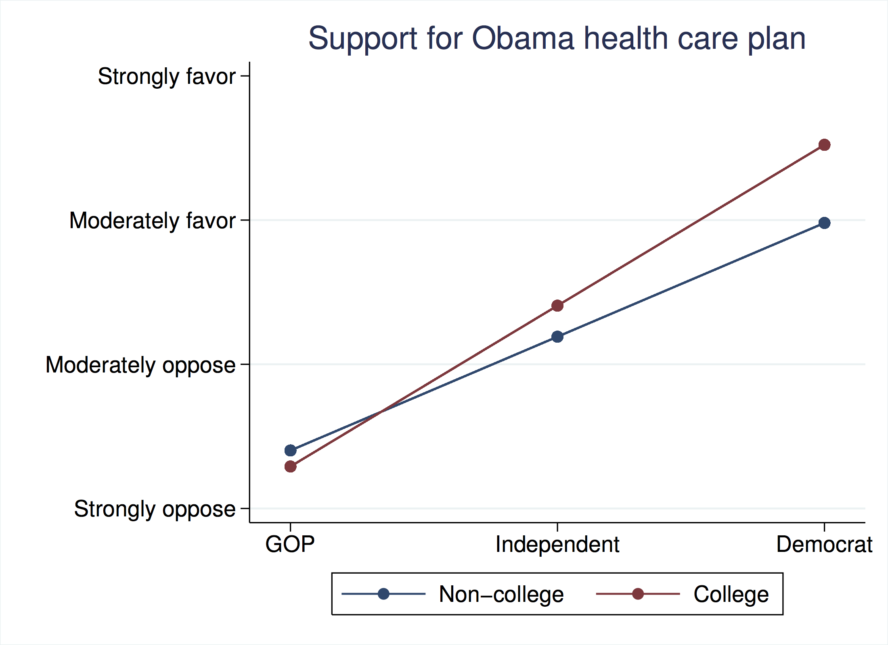

# Fixed effects and interactions

## Fixed effects

In this section, you will learn about how fixed effects models work.  So far we have just talked about regression in the abstract.  Today, we are going to introduce you to a different type of model that will be helpful as you begin to think about what kind of statistical model you want to use for your research project. 

Fixed Effects is extremely useful, as it allows us to study a specific treatment, while accounting for **time-invariant differences** across the same units of study over time, such as states or cities.  It allows us to test a certain effect or theory across that unit.  This differs from other models we’ve seen in the sense that instead of looking at the differences between units such as cities or states (sometimes called a cross-sectional study), we are instead looking at the differences in repeated observations within them over time (sometimes called a panel study).  

### How about an example?

We’re interested in this research question: Are elections fought over non-economic issues more when globalization increases? 

Let’s say our panel data includes repeated observations of Canada, France, the United States and the United Kingdom.  Now, our knowledge up onto this point would tell us to look at how these countries differ among each other.  How does France differ from Canada or the United States in terms of this question?  The problem with this is that there exist many differences between the countries that we can’t account for in our model.   

#### What can we do in order to eliminate this bias? 

How about instead of looking at the difference among each of those countries, we look at the treatment within them over time.  More specifically, with repeated observations of the United States, have elections been fought over non-economic issues more when globalization increases by looking at US elections in 2000, 2002, and 2004? What about Canada, France and the United Kingdom? Have repeated observations of elections in each of those countries showed an increase in these kinds of non-economic focused races? By researching this question using a fixed effects model, we can, to a certain extent, control for this.  We are able to account for time-invariant differences across units and allow us to limit the bias we would have been faced with had we used a different model. 

In order to accomplish this in a regression, we use **dummy variables**.  Like you recently saw in class, dummy variables are simply categorical variables recoded in terms of a quantitative value. 

In a fixed effects model, we use k-1 dummy variables for k units of study. In this case, we would use countries as the dummy variable.  It doesn’t matter what you use as the baseline but make sure you know which one it is as it is necessary when interpreting your results!

#### Visual example

Without a fixed effects model, our regression would look something like this:

There’s not really much to interpret here. There appears to be no relationship between these two variables.  

Now, with a Fixed Effects Regression, we get something that looks like this:

Now this is something we can interpret! As we can see, for each country, as globalization score increases, so does the emphasis on non-economic issues. Without fixed effects, as we saw above, the regression line was almost horizontal and gave us no usable information. But by looking at how these countries change over time as the explanatory variable changes, we are able to get a more detailed understanding of what such effects actually look like. 

### Summary

When you are studying time-varying treatments using panel data, using a Fixed Effects Model is one way to go. Having a different constant for each unit allows you to account for time-invariant confounders.

But there are a few things to worry about here:

1. If you have the same unit observed many times, you may not have truly independent observations.  This can lead us to have incorrect (too small) standard errors.  In a more advanced course you would be taught how to handle these issues.

2. You still have to worry about time-varying confounders.

## Interactions

In this section, you will learn the basics of what an interaction is, what an interaction term looks like in a multiple regression as well as how to interpret it. 

By now, you have (hopefully) learned what a multiple regression is.  The basics of such regressions being that you are testing multiple potential explanatory variables in order to ascertain the effect of one variable ($x_1$) *controlling for* some other variable ($x_2$).

But what if one explanatory factor in some way affects the other’s ability to explain the outcome?  That is, what if the **relationship** between one variable ($x_1$) and the outcome ($y$) varies depending on the value of a third veriable ($x_2$).  

This is what we call an interaction. 

### Defining an interaction

An interaction exists between $x_1$ and $x_2$ in their true effects on Y when the true **effect** of one predictor on $y$ changes as the value of the other predictor changes.

Mathematically, this looks like:

$$y=\beta_0 + \beta_1 x_1 + \beta_2x_2 + \beta_3(x_1 \times x_2) $$

At first look, this may seem strange, right? With regressions, we’re interested in understanding how an explanatory variable affect some specific outcome variable.  Why would we be interested in how explanatory variables relate to each other? 

- By looking at the interaction between explanatory variables, we are able to tell whether or not a change in one of them alters the ability of the other to explain your outcome. 
- Mathematically, this is not too tricky.  We just make a new variable $(x_1 \times x_2)$ and calculate the regression coefficients as normal.  But allowing for interactions between explanatory variables will change the way in which we interpret the outcome. 

### How about an example?

Let’s say we’re interested to know whether or not education strengthens the relationship between party ID and health care reform opinion. 

In this example, we have three variables:

1. Support for the Obama health care plan (1=Strongly oppose, 2=Moderately favor, 3=Moderately oppose, 4=Strongly oppose).
2. Party ID (1=GOP, 2=Independent, 3=Demorat)
3. College education (0=Did not graduate college, 1=Did graduate college)

Here is a depiction of the data from a poll in 2009.

By now, you should be used to seeing an equation that looks like this (without an interaction term):

$$\mbox{Health Care Reform Support}=\beta_0 +\beta_1(\mbox{Party ID}) + \beta_2(\mbox{College})$$

Now we can add in the interaction term.

$$\begin{array}{r}\mbox{Health Care Reform Support} ~=\\ ~ \end{array}\begin{array}{l}\beta_0 +\beta_1(\mbox{PartyID}) + \beta_2(\mbox{College}) + \\ \underset{interaction}{\underbrace{\beta_3(Party \times College)}}\end{array}$$

This term on the end is an interaction term where we simply multiple the college variable by the party variable. That’s all it is! It's a regression with just another covariate added.  It's interpreting the results where things get a bit tricky.

### But what does it all mean?

By adding this interaction term, we are able to see whether or not, changes in one of the explanatory variables in turn creates changes in the other in their effects on support of health care reform.  

| Variable | Coefficient  |
|-----+-------|
|Constant | 1.402 |
| | (0.055) 
Party | 0.789
| | (0.039)
College | -0.111
| | (0.085) 
| Party $\times$ College | 0.326
| | (0.061) |
N = 981 |
$R^2$ = 0.4979 |

How do I read this table? That can be tricky. To some extent, you can read this table like any other: simply divide the coefficient by the standard error and see what is significant. But actually, it can be a bit more comples.

The prediction equation is:

HCR support = (1.40) + (0.79 $\times$ Party) -- (.11 $\times$ College) + (.33 $\times$ Party $\times$ College)

#### What does it mean though?  

Well, the easiest way to see this is to choose specific values for one of the two terms.  

First,  what is the relationship between Party ID and support for the health care reform among non-college educated respondents?  You can find the answer just by putting in the value $0$ in the equation above wherever it says "College." 
	
	
1. HCR support = (1.40) + (0.79 $\times$ Party) -- (.11 $\times$ 0) + (.33 $\times$ Party $\times$ 0)	
2. HCR = 1.40 + 0.79 $\times$ Party 

Second,  what is the relationship between Party ID and support for the health care reform among college educated respondents?  You can find the answer just by putting in the value $1$ in the equation above wherever it says "College." 

1. HCR support = (1.40) + (0.79 $\times$ Party) -- (.11 $\times$ 1) + (.33 $\times$ Party $\times$ 1)
2. HCR support = (1.40 - 0.11) + ((0.79+0.33) $\times$ Party) 
3. HCR support = 1.29 + 1.12 $\times$ Party 

Here are the two lines that we end up with:

#### So ... what?

So what this means is that the relationship between PartyID and support for health care reform is **stronger** (steeper) amont college-educated respondents.  We know this because:

1. The slope is steeper for college-educated respondents (the interaction term is positive)
2. The interaction term is signifcantly different from zero.

### A video on interactions in R

<iframe width="560" height="315" src="https://www.youtube.com/embed/8YuuIsoYqsg" frameborder="0" allowfullscreen></iframe>

